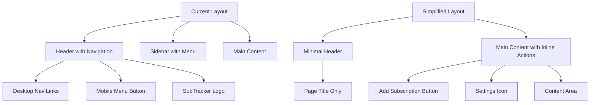
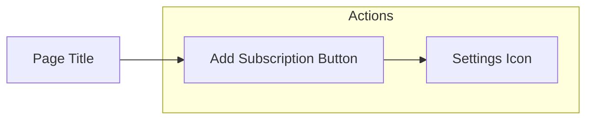

# Interface Simplification Design

## Overview

This design document outlines the interface simplification initiative for the SubTracker application. The goal is to streamline the user interface by removing navigation complexity while maintaining essential functionality access. The simplified interface will focus on the core subscription management workflow with minimal navigation overhead.

### Current State Analysis

The application currently features:
- Header with SubTracker logo and desktop navigation links
- Mobile sidebar with navigation menu
- Four main sections: Подписки (Subscriptions), Аналитика (Analytics), Настройки (Settings)
- Desktop navigation bar with full menu items
- Mobile hamburger menu system

### Target State

The simplified interface will:
- Remove all navigation panels (header navigation and sidebar)
- Eliminate the Analytics tab completely
- Position Settings as an icon next to "Add Subscription" button
- Remove the SubTracker logo from the interface
- Maintain only the core subscription management functionality

## Architecture Changes

### Component Modifications



### Header Component Transformation

**Before:**
- Logo and brand name
- Desktop navigation menu
- Mobile hamburger button
- Full navigation array with 4 items

**After:**
- Minimal header without logo
- No navigation elements
- Clean, simplified appearance
- Optional page context indicators

### Dashboard Header Integration

The main action controls will be integrated directly into the dashboard header:



### Mobile Navigation Removal

**Current Mobile Experience:**
1. Hamburger menu button in header
2. Sidebar overlay with full navigation
3. Backdrop for closing sidebar

**Simplified Mobile Experience:**
1. No hamburger menu
2. No sidebar navigation
3. Direct access to settings via icon
4. All actions available on main screen

## User Interface Changes

### Header Layout Update

**Current Header Structure:**
```
[Menu] [Logo + SubTracker] ..................... [Nav: Подписки | Аналитика | Настройки]
```

**New Header Structure:**
```
[Empty] .................................................... [Empty]
```

### Dashboard Action Bar

The dashboard will include an enhanced action bar:

**Current Dashboard Header:**
```
Подписки                                    [+ Добавить подписку]
Отслеживайте свои подписки и расходы
```

**New Dashboard Header:**
```
Подписки                            [⚙️] [+ Добавить подписку]
Отслеживайте свои подписки и расходы
```

### Settings Access Pattern

Settings will be accessible through:
- Icon button positioned to the left of "Add Subscription"
- Gear icon (⚙️) for universal recognition
- Consistent positioning across viewport sizes
- Tooltip for clarity: "Настройки"

### Analytics Functionality Removal

Complete removal of analytics features:
- Remove analytics route from routing system
- Remove analytics navigation items
- Remove analytics page component
- Remove analytics-related state management
- Remove analytics data calculations and hooks

## Component Architecture

### Layout Component Simplification

**Current Layout Hierarchy:**
```
Layout
├── Header (with navigation)
├── Sidebar (mobile navigation)
└── Main Content
```

**Simplified Layout Hierarchy:**
```
Layout
├── Minimal Header (optional)
└── Main Content with Inline Actions
```

### Routing Structure Update

**Current Routes:**
- `/app/dashboard` - Main subscriptions view
- `/app/subscriptions` - Redundant with dashboard
- `/app/analytics` - To be removed
- `/app/settings` - Accessible via icon

**Simplified Routes:**
- `/app/dashboard` - Main and only subscription view
- `/app/settings` - Accessible via icon (modal or separate page)

### State Management Updates

Remove analytics-related state:
- Analytics data calculations
- Analytics filters and sorting
- Analytics navigation state
- Analytics route parameters

Maintain essential state:
- Subscription management
- Settings configuration
- UI state for modals and interactions

## Implementation Strategy

### Phase 1: Navigation Removal
1. Remove navigation array from Header component
2. Remove Sidebar component completely
3. Remove mobile menu toggle functionality
4. Remove navigation-related state management

### Phase 2: Analytics Elimination
1. Remove Analytics route from App routing
2. Remove Analytics page component
3. Remove analytics-related imports and dependencies
4. Clean up analytics state management functions

### Phase 3: Settings Integration
1. Add Settings icon to Dashboard header
2. Position icon next to Add Subscription button
3. Implement settings access (modal or navigation)
4. Add appropriate spacing and styling

### Phase 4: Logo Removal
1. Remove SubTracker logo from Header
2. Remove brand text elements
3. Simplify header styling
4. Optimize header spacing

## User Experience Considerations

### Navigation Workflow Changes

**Current User Flow:**
1. User navigates via header/sidebar menu
2. Analytics accessible through navigation
3. Settings accessible through navigation
4. Multiple navigation entry points

**Simplified User Flow:**
1. User lands directly on main dashboard
2. All actions available on single screen
3. Settings accessible via dedicated icon
4. No navigation required for core functionality

### Accessibility Improvements

- Settings icon includes proper ARIA labels
- Keyboard navigation for settings access
- Focus management for simplified interface
- Screen reader friendly action buttons

### Responsive Design Considerations

**Desktop Experience:**
- Settings icon positioned in top-right action area
- Proper spacing between Add Subscription and Settings
- Hover states for interactive elements

**Mobile Experience:**
- Touch-friendly settings icon sizing
- Adequate spacing for finger navigation
- No hamburger menu confusion
- Direct access to all functions

## Testing Strategy

### Component Testing
- Header component renders without navigation
- Dashboard includes settings icon
- Settings icon functionality
- Add subscription button remains functional

### Integration Testing
- Routing works without analytics routes
- Settings access from dashboard
- Modal/page navigation for settings
- Mobile responsiveness validation

### User Acceptance Testing
- User can access settings easily
- No confusion about missing navigation
- Streamlined workflow validation
- Mobile usability confirmation

## Technical Implementation Details

### Component File Changes

**Header.jsx modifications:**
- Remove navigation array
- Remove desktop navigation rendering
- Remove mobile menu button
- Remove logo and brand elements
- Simplify component structure

**Layout.jsx modifications:**
- Remove Sidebar component import
- Remove sidebar state management
- Simplify layout structure
- Update main content styling

**Dashboard.jsx modifications:**
- Add Settings icon to header area
- Position icon next to Add Subscription button
- Implement settings click handler
- Maintain existing subscription functionality

### Routing Configuration
```javascript
// Remove analytics route
const routes = [
  { path: '/app/dashboard', component: Dashboard },
  { path: '/app/settings', component: Settings },
  // Analytics route removed
];
```

### Icon Implementation
```jsx
// Settings icon in Dashboard header
<div className="flex items-center space-x-3">
  <Button
    variant="ghost"
    size="sm"
    onClick={() => navigate('/app/settings')}
    className="flex items-center"
    title="Настройки"
  >
    <Settings className="h-5 w-5" />
  </Button>
  <Button onClick={() => setIsModalOpen(true)} className="flex items-center space-x-2">
    <Plus className="h-4 w-4" />
    <span>Добавить подписку</span>
  </Button>
</div>
```

## Performance Implications

### Bundle Size Reduction
- Remove analytics page component
- Remove navigation-related JavaScript
- Reduce overall component complexity
- Smaller routing configuration

### Runtime Performance
- Fewer components to render
- Simplified state management
- Reduced re-render cycles
- Faster initial page load

### Memory Usage
- Less navigation state tracking
- Reduced component tree depth
- Simplified event handling
- Lower memory footprint