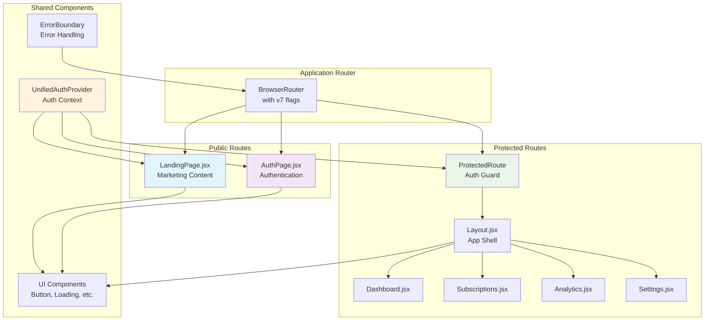
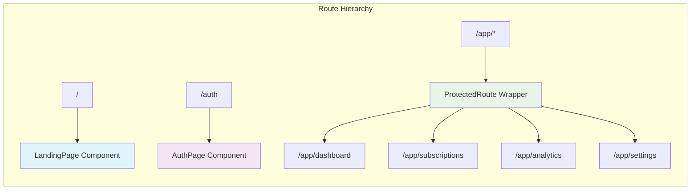
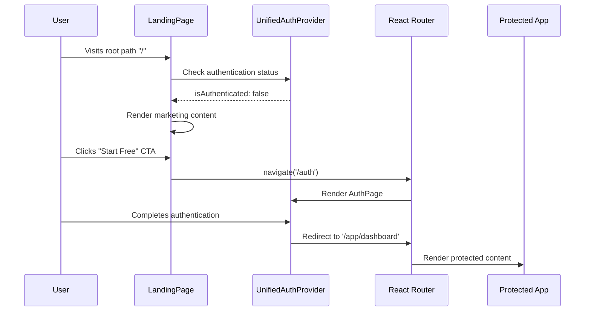

# Marketing Landing Page Integration Design

## Overview

This design outlines the integration of a marketing landing page for unauthenticated users into the existing subscription tracking application. The landing page will serve as the entry point for new users, showcasing the application's features and value proposition while providing seamless navigation to the authentication system.

## Technology Stack & Dependencies

The integration will leverage the existing technology stack:

- **Frontend Framework**: React 18.3.1 with JSX
- **Routing**: React Router DOM v6 with future flags enabled
- **Styling**: Tailwind CSS 3.4.1 with custom configurations
- **Icons**: Lucide React for consistent iconography
- **Build Tool**: Vite 5.4.2 for development and production builds
- **State Management**: Zustand unified store for authentication state
- **Backend**: Supabase for authentication and data persistence

## Architecture

### Component Integration Strategy



### Routing Architecture

The routing structure will be modified to include a public landing page route:



## Component Architecture

### LandingPage Component

The LandingPage component will be a comprehensive marketing page featuring:

**Structure:**
- **Navigation Header**: Logo, navigation links, CTA button
- **Hero Section**: Value proposition with visual demonstration
- **Features Section**: Key functionality highlights
- **Analytics Showcase**: Data visualization preview
- **About Section**: Product benefits and trust signals
- **Footer**: Contact information and legal links

**Component Definition:**
```jsx
// src/components/LandingPage.jsx
import React, { useState } from 'react';
import { useNavigate } from 'react-router-dom';
import { useUnifiedAuth } from './auth/UnifiedAuthProvider.jsx';
import Button from './ui/Button.jsx';
import { 
  CreditCard, BarChart3, Smartphone, Shield, 
  Calendar, TrendingUp, Users, CheckCircle, 
  ArrowRight, Menu, X, Bell, Filter 
} from 'lucide-react';

const LandingPage = () => {
  const [mobileMenuOpen, setMobileMenuOpen] = useState(false);
  const navigate = useNavigate();
  const { isAuthenticated } = useUnifiedAuth();
  
  // Redirect authenticated users to dashboard
  useEffect(() => {
    if (isAuthenticated) {
      navigate('/app/dashboard');
    }
  }, [isAuthenticated, navigate]);
  
  // Component implementation...
};
```

**Props Interface:**
- No external props required
- Internal state for mobile menu toggle
- Navigation hooks for routing

**Key Features:**
- Responsive design for all device sizes
- Smooth scrolling navigation between sections
- Interactive demo data visualization
- Conversion-optimized CTA buttons
- Accessible navigation patterns

### Navigation Integration

The landing page navigation will integrate with the existing authentication system:

**CTA Button Behavior:**
- **Unauthenticated Users**: Navigate to `/auth` page
- **Authenticated Users**: Redirect to `/app/dashboard`
- **Loading State**: Show loading spinner during auth check

**Navigation Links:**
- Internal anchor links for page sections (#features, #analytics, #about)
- Smooth scrolling implementation
- Mobile-responsive hamburger menu

### Authentication Flow Integration



## Routing & Navigation

### Route Configuration

The application routing will be restructured to accommodate the new landing page:

**Current Routing Structure:**
```jsx
// Before integration
<Routes>
  <Route path="/auth" element={<AuthPage />} />
  <Route path="/*" element={<ProtectedRoute>...</ProtectedRoute>} />
</Routes>
```

**New Routing Structure:**
```jsx
// After integration
<Routes>
  {/* Public routes */}
  <Route path="/" element={<LandingPage />} />
  <Route path="/auth" element={<AuthPage />} />
  
  {/* Protected app routes */}
  <Route path="/app/*" element={
    <ProtectedRoute>
      <Layout>
        <Routes>
          <Route path="dashboard" element={<Dashboard />} />
          <Route path="subscriptions" element={<Subscriptions />} />
          <Route path="analytics" element={<Analytics />} />
          <Route path="settings" element={<Settings />} />
          <Route path="*" element={<Navigate to="/app/dashboard" replace />} />
        </Routes>
      </Layout>
    </ProtectedRoute>
  } />
  
  {/* Catch-all redirect */}
  <Route path="*" element={<Navigate to="/" replace />} />
</Routes>
```

### Navigation Patterns

**Unauthenticated Users:**
- `/` → Landing Page (marketing content)
- `/auth` → Authentication page
- Any protected route → Redirect to `/auth`

**Authenticated Users:**
- `/` → Redirect to `/app/dashboard`
- `/auth` → Redirect to `/app/dashboard`
- `/app/*` → Protected application routes

### URL Migration Strategy

To maintain backward compatibility and SEO:

**Redirect Rules:**
- Legacy dashboard access patterns redirect to `/app/dashboard`
- Bookmark compatibility for existing users
- Search engine URL preservation

## Styling Strategy

### Design System Integration

The landing page will integrate with the existing Tailwind CSS design system:

**Color Palette:**
- Primary: `gray-900` (consistent with existing UI)
- Secondary: `gray-600` and `gray-400` for text hierarchy
- Background: `gray-50` for sections, `white` for cards
- Accent: Subtle use of existing UI component colors

**Typography Scale:**
- Headings: `text-2xl` to `text-4xl` with `font-bold`
- Body text: `text-sm` to `text-lg` with appropriate `text-gray-*`
- Responsive typography with `sm:` and `lg:` breakpoints

**Spacing System:**
- Consistent padding: `px-4 sm:px-6 lg:px-8`
- Section spacing: `py-12` with responsive adjustments
- Component gaps: `gap-3` to `gap-10` based on hierarchy

### Component Styling Patterns

**Card Components:**
```css
.feature-card {
  @apply bg-white p-6 rounded-lg border border-gray-200 hover:border-gray-300 transition-colors;
}
```

**Button Variants:**
- Primary CTA: `bg-gray-900 text-white hover:bg-gray-800`
- Secondary: `text-gray-600 hover:text-gray-900`
- Consistent with existing Button component styling

**Responsive Breakpoints:**
- Mobile-first approach with `md:` and `lg:` breakpoints
- Grid systems: `grid-cols-1 md:grid-cols-2 lg:grid-cols-3`
- Flexible layout patterns for all screen sizes

## State Management

### Authentication State Integration

The landing page will leverage the existing UnifiedAuthProvider for state management:

**State Dependencies:**
```jsx
const { isAuthenticated, loading } = useUnifiedAuth();
```

**State-Driven Behavior:**
- **Loading State**: Show minimal loading indicator
- **Authenticated**: Redirect to dashboard
- **Unauthenticated**: Show full marketing content

### Local Component State

**Mobile Menu State:**
```jsx
const [mobileMenuOpen, setMobileMenuOpen] = useState(false);
```

**Demo Data State:**
- Static demo data for analytics preview
- No external API calls required
- Consistent with existing subscription data structure

### Navigation State

**Scroll Behavior:**
- Smooth scrolling to anchored sections
- Active section highlighting in navigation
- Mobile menu auto-close on navigation

## API Integration Layer

### Authentication Integration

The landing page will integrate with the existing authentication flow:

**Supabase Auth Integration:**
- Uses existing `UnifiedAuthProvider` context
- Leverages current auth service methods
- No additional API endpoints required

**Authentication Methods:**
- `signIn()`: Redirect to dashboard on success
- `signUp()`: Redirect to dashboard on success
- Error handling consistent with existing patterns

### Data Integration

**Demo Data Strategy:**
- Static demonstration data for marketing purposes
- Consistent data structure with actual subscription models
- No real user data exposure on public page

**Real-time Features:**
- No real-time subscriptions on landing page
- Authentication state changes handled by existing providers
- Smooth transition to real-time features post-authentication

## Testing Strategy

### Component Testing

**Unit Tests:**
```jsx
describe('LandingPage Component', () => {
  test('renders marketing content for unauthenticated users', () => {
    // Test implementation
  });
  
  test('redirects authenticated users to dashboard', () => {
    // Test implementation
  });
  
  test('handles mobile menu toggle correctly', () => {
    // Test implementation
  });
  
  test('navigation CTAs work correctly', () => {
    // Test implementation
  });
});
```

**Integration Tests:**
- Authentication flow from landing page to dashboard
- Navigation between public and protected routes
- Responsive design functionality across breakpoints

### User Experience Testing

**Key User Journeys:**
1. **First-time visitor**: Landing page → Auth → Dashboard
2. **Returning user**: Landing page → Auto-redirect to Dashboard
3. **Mobile user**: Responsive navigation and content consumption

**Performance Testing:**
- Page load times for marketing assets
- Bundle size impact of additional components
- Lazy loading implementation for demo content

### Accessibility Testing

**WCAG Compliance:**
- Proper heading hierarchy (h1, h2, h3)
- Alt text for decorative elements
- Keyboard navigation support
- Screen reader compatibility

**Focus Management:**
- Tab order for navigation elements
- Skip links for main content
- Mobile menu accessibility patterns

## File Structure Changes

### New Files

```
src/
├── components/
│   ├── LandingPage.jsx          # Main landing page component
│   └── landing/                 # Landing page specific components
│       ├── HeroSection.jsx      # Hero section with CTA
│       ├── FeaturesSection.jsx  # Features showcase
│       ├── AnalyticsDemo.jsx    # Analytics preview
│       └── AboutSection.jsx     # About and benefits
```

### Modified Files

```
src/
├── App.jsx                      # Updated routing structure
└── components/
    └── auth/
        └── ProtectedRoute.jsx   # Updated redirect logic
```

### Asset Organization

```
src/
├── assets/
│   └── landing/                 # Landing page specific assets
│       ├── demo-data.js         # Static demo data
│       └── analytics-mock.js    # Mock analytics data
```