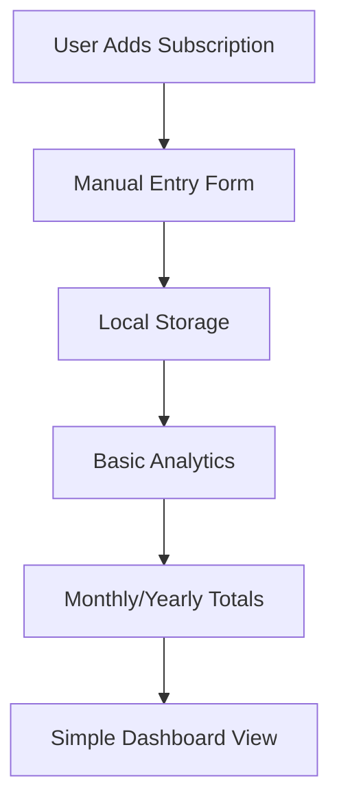

# Marketing Page Simplification Design

## Overview

This design document outlines the simplification of the landing page marketing content to accurately reflect the real functionality of the subscription tracking application. The current marketing page makes exaggerated claims and promises features that don't exist, creating unrealistic user expectations.

## Current State Analysis

### Marketing Claims vs Reality

| Marketing Claim | Reality | Recommendation |
|----------------|---------|----------------|
| "15,000+ Пользователей" | No real user base | Remove fake statistics |
| "$2.4М+ Общая экономия" | No savings tracking | Remove claims about savings |
| "98% Рейтинг удовлетворённости" | No user reviews/ratings | Remove satisfaction claims |
| "Автоматическое отслеживание" | Manual input only | Clarify manual process |
| "Умные напоминания" | No notification system | Remove notification promises |
| "Защита банковского уровня" | Simple local storage | Clarify data storage approach |
| "Синхронизация в реальном времени" | Basic Zustand state | Remove real-time claims |
| "Мобильное приложение" | Web-only application | Remove mobile app references |
| "Экспорт данных" | No export functionality | Remove export claims |

### Actual Application Features

The subscription tracker is a simple web application with the following **real** capabilities:

1. **Manual Subscription Management**
   - Add subscriptions with name, cost, billing cycle, category
   - Edit existing subscriptions
   - Toggle subscription active/inactive status
   - Delete subscriptions

2. **Basic Analytics**
   - Total monthly spending calculation
   - Total yearly spending projection
   - Upcoming payments (7/30 day view)
   - Active subscription count

3. **Simple Organization**
   - Categorization (entertainment, productivity, health, etc.)
   - Basic filtering by category and status
   - Search by subscription name
   - Sort by different criteria

4. **Local Data Storage**
   - Zustand store with local persistence
   - Optional Supabase authentication and sync
   - No automatic bank connections

## Simplified Marketing Strategy

### Core Value Proposition

**"Simple subscription tracking for personal budgeting"**

Instead of promising advanced features, focus on the core benefit: helping users manually track and understand their subscription spending.

### Honest Feature Communication



## Component Redesign Specifications

### 1. HeroSection Simplification

**Remove:**
- Fake trust signals ("Нам доверяют тысячи пользователей")
- Fake ratings ("4.9/5 от 2000+ отзывов") 
- Promises about smart notifications
- Real-time tracking claims

**Keep:**
- Basic subscription tracking promise
- Simple dashboard preview
- Core benefit: "Возьмите под контроль свои подписки"

**New Content Structure:**
```
Заголовок: "Простое отслеживание подписок"
Подзаголовок: "Вручную добавляйте и отслеживайте свои регулярные расходы в одном месте"
Ключевые возможности:
- ✓ Добавление подписок вручную
- ✓ Подсчёт месячных расходов  
- ✓ Простая категоризация
```

### 2. FeaturesSection Accuracy

**Remove Features:**
- "Автоматически категоризируйте" → Change to "Вручную категоризируйте"
- "Умные напоминания" → Remove entirely
- "Защита банковского уровня" → Replace with "Локальное хранение данных"
- "Календарь платежей" → Remove (not implemented)
- "Авто-категоризация" → Remove
- "Обнаружение расходов" → Remove
- "Прогнозы расходов" → Remove

**Honest Features to Highlight:**
1. **Ручное добавление подписок**
   - Название, стоимость, периодичность
   - Выбор категории из списка
   - Описание (опционально)

2. **Базовая аналитика**
   - Месячные и годовые суммы
   - Количество активных подписок
   - Предстоящие платежи

3. **Простая организация**
   - Фильтрация по категориям
   - Поиск по названию
   - Сортировка

**Remove Statistics:**
```javascript
// Remove entirely:
- "$2.4М+ Общая экономия"
- "15,000+ Активных пользователей" 
- "98% Рейтинг удовлетворённости"
```

### 3. AboutSection Truthfulness

**Remove:**
- All fake testimonials
- Savings claims ("Экономьте в среднем $200+ в год")
- Export functionality promises
- Budget limit features
- Tax export capabilities

**Keep Simple:**
- Basic tracking benefit
- Manual process explanation
- Local data storage clarification

### 4. AnalyticsDemo Realistic Preview

**Current Demo Shows:**
- Mock spending trends
- Fake insights
- Non-existent features

**Simplified Demo Should Show:**
- Basic subscription list
- Simple monthly total
- Upcoming payments
- Category breakdown (pie chart)

## Implementation Approach

### Phase 1: Content Removal
1. Remove all fake statistics and user counts
2. Remove promises of non-existent features
3. Remove fake testimonials
4. Remove claims about automatic functionality

### Phase 2: Honest Messaging
1. Replace with realistic feature descriptions
2. Emphasize manual nature of tracking
3. Focus on simplicity as a benefit
4. Clarify local storage approach

### Phase 3: Visual Simplification
1. Simplify hero section graphics
2. Remove complex feature illustrations
3. Use simpler, more honest mock data
4. Focus on actual application screenshots

## Updated Component Structure

```
LandingPage
├── Navigation (simplified)
├── HeroSection (honest messaging)
├── FeaturesSection (realistic features only)
├── SimpleDemo (actual app functionality)
└── CallToAction (clear expectations)
```

### Recommended Navigation Changes

**Current:**
- "Аналитика" (implies advanced features)
- "Возможности" (over-promises capabilities)

**Simplified:**
- "Функции" (basic features)
- "Как это работает" (process explanation)

## Content Guidelines

### Writing Principles
1. **Honesty First** - Never promise features that don't exist
2. **Simplicity Focus** - Present simplicity as a benefit, not a limitation
3. **Manual Process** - Be clear that this requires user input
4. **Local Storage** - Explain data stays on user's device primarily
5. **No Fake Social Proof** - Remove all fake statistics and reviews

### Tone Adjustments
- From: "Умная платформа с AI" 
- To: "Простой инструмент для личного учёта"

- From: "Автоматическое отслеживание"
- To: "Удобное ручное добавление"

## Testing Strategy

### User Expectation Validation
1. **A/B Testing** - Compare simplified vs current landing page
2. **User Feedback** - Collect feedback on expectation vs reality gap
3. **Conversion Tracking** - Monitor sign-up to retention rates
4. **Feature Request Analysis** - Track requests for "missing" features

### Success Metrics
- Reduced expectation vs reality gap
- Higher user retention after signup
- Fewer support requests about "missing" features
- More positive user feedback about honesty

## Risk Mitigation

### Potential Concerns
1. **Lower Conversion** - Simplified messaging might reduce signups
2. **Competitive Disadvantage** - Other tools may appear more feature-rich
3. **Perception Issues** - Users might see simplicity as limitation

### Mitigation Strategies
1. **Emphasize Benefits of Simplicity**
   - Faster setup time
   - No learning curve
   - Privacy (local storage)
   - No subscription fees

2. **Target Right Audience**
   - Users wanting simple solutions
   - Privacy-conscious users
   - Budget-tracking beginners

3. **Clear Value Communication**
   - "Get started in 2 minutes"
   - "No complex setup required"
   - "Your data stays private"