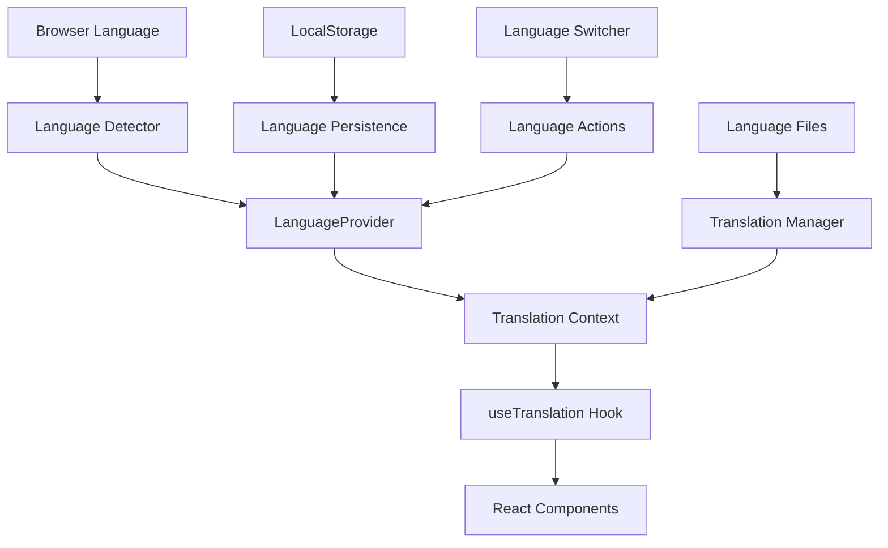
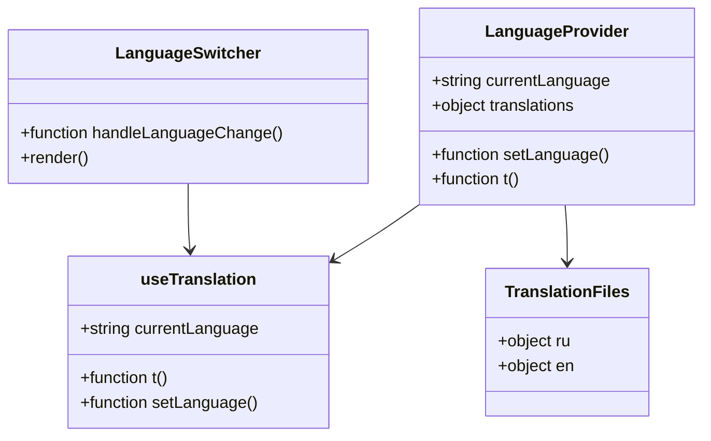
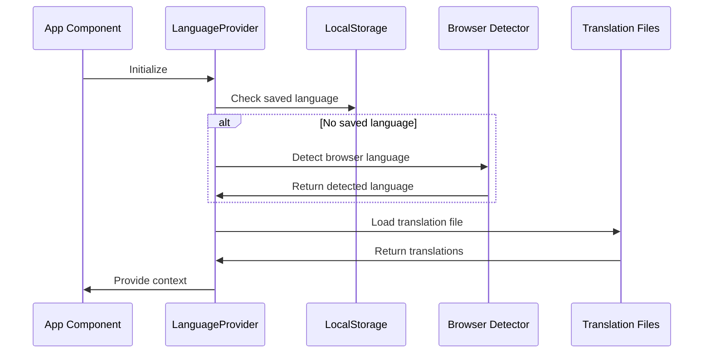
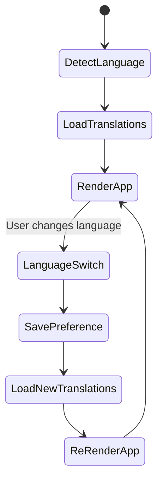
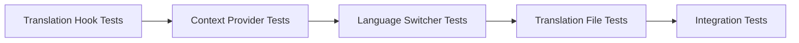
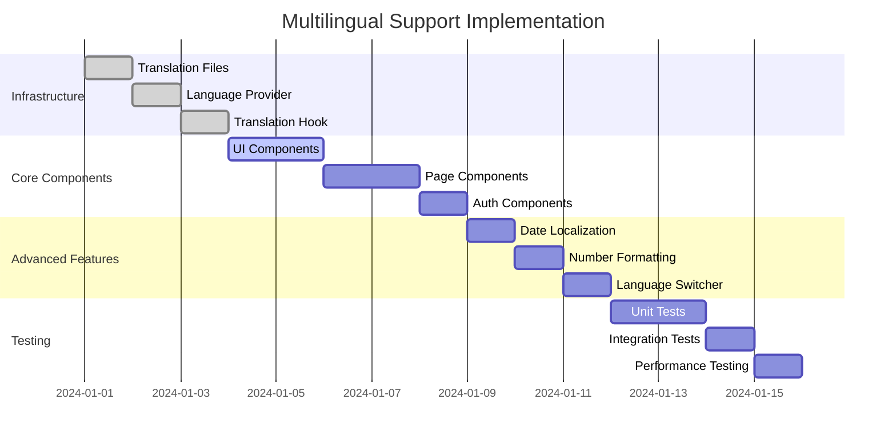

# Multilingual Support Design

## Overview

This design outlines the implementation of multilingual support for the subscription tracker application, currently supporting Russian and requiring the addition of English language support. The solution implements a lightweight internationalization (i18n) system that integrates seamlessly with the existing React/Zustand architecture while maintaining performance and developer experience.

## Technology Stack & Dependencies

### Core Dependencies
- **React Context API**: Language context provider for state management
- **Custom Translation Hook**: `useTranslation` hook for component-level translation access
- **Browser Language Detection**: Automatic language detection from browser settings
- **Local Storage Persistence**: User language preference persistence

### New Dependencies
```json
{
  "react-intl-formatted-number": "^1.0.0" // For number/currency formatting
}
```

## Component Architecture

### Translation System Architecture



### Component Hierarchy



## Data Models & Types

### Language Configuration
```javascript
export const SUPPORTED_LANGUAGES = {
  RU: 'ru',
  EN: 'en'
};

export const LANGUAGE_OPTIONS = [
  { value: 'ru', label: 'Русский', flag: '🇷🇺' },
  { value: 'en', label: 'English', flag: '🇺🇸' }
];
```

### Translation Structure
```javascript
export const translationSchema = {
  // Navigation & Layout
  nav: {
    dashboard: '',
    subscriptions: '',
    settings: ''
  },
  
  // Common UI Elements
  common: {
    save: '',
    cancel: '',
    delete: '',
    edit: '',
    add: '',
    search: '',
    filter: '',
    loading: ''
  },
  
  // Subscription Management
  subscriptions: {
    title: '',
    addNew: '',
    editSubscription: '',
    name: '',
    description: '',
    amount: '',
    category: '',
    billingCycle: '',
    nextPayment: '',
    website: '',
    active: '',
    deleteConfirm: ''
  },
  
  // Categories & Billing Cycles
  categories: {
    entertainment: '',
    utilities: '',
    software: '',
    food: '',
    health: '',
    other: ''
  },
  
  billingCycles: {
    weekly: '',
    monthly: '',
    yearly: ''
  },
  
  // Dashboard & Analytics
  dashboard: {
    title: '',
    subtitle: '',
    monthlySpending: '',
    yearlySpending: '',
    activeSubscriptions: '',
    upcomingPayments: '',
    noPayments: '',
    noSubscriptions: ''
  },
  
  // Authentication
  auth: {
    signIn: '',
    signUp: '',
    email: '',
    password: '',
    createAccount: '',
    alreadyHaveAccount: '',
    noAccount: ''
  },
  
  // Settings
  settings: {
    title: '',
    language: '',
    dataManagement: '',
    exportData: '',
    deleteAllData: '',
    deleteConfirm: ''
  }
};
```

## Business Logic Layer

### Translation Context Implementation



### Language Switching Flow



## Middleware & Interceptors

### Language Detection Middleware
```javascript
const languageDetector = {
  detect: () => {
    // 1. Check localStorage
    const saved = localStorage.getItem('preferred-language');
    if (saved && SUPPORTED_LANGUAGES[saved.toUpperCase()]) {
      return saved;
    }
    
    // 2. Check browser language
    const browserLang = navigator.language.split('-')[0];
    if (Object.values(SUPPORTED_LANGUAGES).includes(browserLang)) {
      return browserLang;
    }
    
    // 3. Default to Russian
    return SUPPORTED_LANGUAGES.RU;
  },
  
  save: (language) => {
    localStorage.setItem('preferred-language', language);
  }
};
```

### Translation Middleware
```javascript
const translationMiddleware = {
  interpolate: (template, values = {}) => {
    return template.replace(/\{\{(\w+)\}\}/g, (match, key) => {
      return values[key] || match;
    });
  },
  
  plural: (count, translations) => {
    // Russian pluralization rules
    if (currentLanguage === 'ru') {
      const n = Math.abs(count);
      if (n % 10 === 1 && n % 100 !== 11) return translations.one;
      if ([2, 3, 4].includes(n % 10) && ![12, 13, 14].includes(n % 100)) return translations.few;
      return translations.many;
    }
    
    // English pluralization rules
    return count === 1 ? translations.one : translations.other;
  }
};
```

## Testing Strategy

### Unit Testing Requirements



### Test Cases Structure
```javascript
describe('Translation System', () => {
  describe('useTranslation Hook', () => {
    test('should return correct translation');
    test('should handle missing keys gracefully');
    test('should support interpolation');
    test('should handle pluralization');
  });
  
  describe('LanguageProvider', () => {
    test('should detect browser language');
    test('should save language preference');
    test('should load correct translation file');
  });
  
  describe('Component Integration', () => {
    test('should render components in correct language');
    test('should switch languages dynamically');
    test('should persist language choice');
  });
});
```

## Migration Strategy

### Phase 1: Core Infrastructure
1. Create translation files (`ru.js`, `en.js`)
2. Implement `LanguageProvider` and `useTranslation` hook
3. Add language detection and persistence utilities

### Phase 2: Component Migration
1. Update UI components (`Button`, `Input`, `Select`, `Modal`)
2. Migrate core pages (`Dashboard`, `Subscriptions`, `Settings`)
3. Update authentication components

### Phase 3: Advanced Features
1. Implement date/time localization with `date-fns` locales
2. Add number/currency formatting for different locales
3. Implement language switcher component

### Phase 4: Integration & Testing
1. Integration testing across all components
2. Browser compatibility testing
3. Performance optimization

## Implementation Roadmap



## Performance Considerations

### Bundle Size Optimization
- Lazy loading of translation files
- Tree shaking of unused translations
- Compression of translation JSON files

### Runtime Performance
- Memoization of translation functions
- Efficient re-rendering with React.memo
- Context value optimization

### Loading Strategy
```javascript
const translationLoader = {
  async loadTranslations(language) {
    const module = await import(`../translations/${language}.js`);
    return module.default;
  },
  
  preloadTranslations() {
    // Preload all supported languages for better UX
    SUPPORTED_LANGUAGES.forEach(lang => {
      this.loadTranslations(lang);
    });
  }
};
```

## Error Handling & Fallbacks

### Translation Error Handling
```javascript
const safeTranslate = (key, fallback = key) => {
  try {
    const translation = getNestedTranslation(translations, key);
    return translation || fallback;
  } catch (error) {
    console.warn(`Translation missing for key: ${key}`);
    return fallback;
  }
};
```

### Language Fallback Strategy
1. **Primary**: User selected language
2. **Secondary**: Browser detected language  
3. **Fallback**: Russian (default)
4. **Emergency**: Display translation key as text

## Integration Points

### Zustand Store Integration
```javascript
const languageSlice = (set, get) => ({
  language: {
    current: 'ru',
    setLanguage: (lang) => set((state) => ({
      language: { ...state.language, current: lang }
    })),
  }
});
```

### React Router Integration
- Language-aware routing (optional future enhancement)
- URL parameter language detection
- Route-based language switching

### Supabase Integration
- User language preference storage in profiles table
- Server-side language preference synchronization
- Real-time language preference updates


