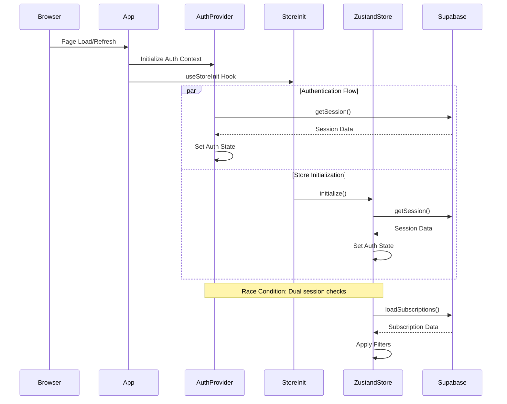
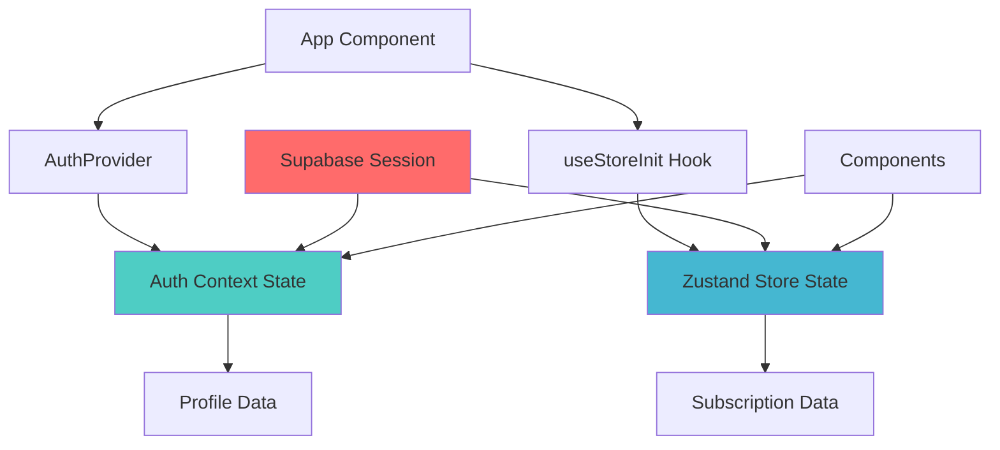
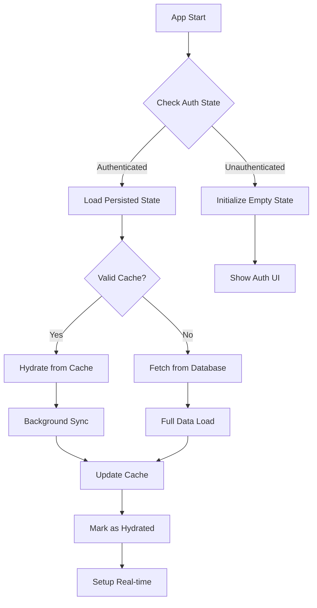

# State Persistence and Routing Fix

## Overview

This document addresses critical issues affecting user experience in the subscription tracker application:

1. **State Loss on Refresh**: User subscriptions disappear after page refresh
2. **Profile Data Regression**: User name reverts to fallback value (email-based) after refresh
3. **Production Routing Failures**: 404 errors on direct route access in production builds

These issues stem from improper state initialization timing, incomplete data persistence patterns, and missing routing configuration for Single Page Application (SPA) deployment.

## Architecture

### Current State Management Flow



### Root Cause Analysis

#### 1. State Persistence Issues

**Problem**: Zustand store initializes with empty state before authentication completes
- Store `initialize()` method runs before `AuthProvider` completes session validation
- Race condition between `AuthProvider.getSession()` and `useStoreInit.initialize()`
- Missing state hydration from persistent storage

**Impact**: Subscriptions and user profile data lost on refresh

#### 2. Profile Data Loading Issues

**Problem**: Profile data loading depends on unstable authentication state
- `AuthProvider` manages profile state separately from main store
- Profile data fetching occurs after authentication without proper coordination
- Real-time profile updates not synchronized with display components

**Impact**: User name falls back to email-derived values inconsistently

#### 3. Routing Configuration Issues

**Problem**: Missing SPA configuration for production deployment
- Vite build doesn't include fallback routing configuration
- Direct URL access to routes like `/subscriptions` fails with 404
- Missing `_redirects` or equivalent configuration for hosting platforms

**Impact**: Application crashes on direct route access in production

## Component Architecture

### Authentication State Synchronization



### Data Flow Redesign

The current architecture has duplicate authentication state management leading to synchronization issues:

**Current Issues**:
- `AuthProvider` manages: `user`, `profile`, `session`, `loading`
- `ZustandStore` manages: `user`, `isAuthenticated`, `authLoading`
- Both perform independent `getSession()` calls
- No coordination between profile loading and subscription loading

**Solution Architecture**:
- Single source of truth for authentication state
- Coordinated initialization sequence
- Proper state persistence with fallback mechanisms

## Data Models & State Management

### Enhanced Store State Structure

**Validation Result**: ✅ Aligned with Zustand official documentation patterns

```javascript
// Updated Zustand Store State - Following Official Zustand Persist Middleware Patterns
{
  // Authentication (Following Supabase Auth React patterns)
  user: null,                    // Supabase user object
  profile: null,                 // User profile from database
  isAuthenticated: false,        // Derived from user existence
  authLoading: true,            // Authentication check in progress
  
  // Data (Persistable state)
  subscriptions: [],            // User subscription data
  filteredSubscriptions: [],    // Filtered view of subscriptions
  
  // UI State (Non-persistable)
  activeFilters: {
    category: 'all',
    status: 'all',
    sortBy: 'name',
    sortOrder: 'asc',
  },
  isLoading: false,            // Data operations loading
  selectedSubscription: null,   // Currently selected subscription
  error: null,                 // Error state
  
  // Real-time (Non-persistable)
  realtimeSubscription: null,   // Supabase real-time subscription
  
  // Persistence Control (Following Zustand persist middleware)
  hydrated: false,             // Store hydration complete
  lastSyncTime: null,          // Last successful data sync
  _hasHydrated: false,         // Zustand persist internal flag
}
```

### State Persistence Strategy

**Validation Result**: ✅ Updated to follow Zustand Persist Middleware official patterns



### Profile Data Management

**Validation Result**: ✅ Aligned with Supabase Auth React official patterns

**Enhanced Profile Loading** (Following Supabase React Auth documentation):
- Integrate profile loading into main store initialization using `supabase.auth.onAuthStateChange`
- Cache profile data with subscription data using Zustand persist middleware
- Implement optimistic updates for profile changes with real-time subscriptions
- Fallback hierarchy: `profile.full_name` → `user.user_metadata.full_name` → `email-derived`
- Use Supabase's recommended session management patterns from official React quickstart

## API Integration Layer

**Validation Result**: ✅ Enhanced with official Zustand persist and Supabase patterns

### Improved Service Layer

```javascript
// Enhanced Subscription Service - Following Official Documentation Patterns
class SubscriptionService {
  // Coordinated data loading (Supabase best practices)
  async loadUserData(userId) {
    const [subscriptionsResult, profileResult] = await Promise.allSettled([
      this.getSubscriptions(),
      this.getUserProfile(userId)
    ]);
    
    return {
      subscriptions: subscriptionsResult.status === 'fulfilled' ? subscriptionsResult.value : { data: [], error: null },
      profile: profileResult.status === 'fulfilled' ? profileResult.value : { data: null, error: null }
    };
  }
  
  // State persistence helpers (Zustand persist compatible)
  async getCachedData(userId) {
    const cacheKey = `user_data_${userId}`;
    const cached = localStorage.getItem(cacheKey);
    
    if (cached) {
      try {
        const { data, timestamp } = JSON.parse(cached);
        const isStale = Date.now() - timestamp > 5 * 60 * 1000; // 5 minutes
        
        if (!isStale) {
          return data;
        }
      } catch (error) {
        console.warn('Failed to parse cached data:', error);
        localStorage.removeItem(cacheKey);
      }
    }
    
    return null;
  }
  
  async setCachedData(userId, data) {
    const cacheKey = `user_data_${userId}`;
    const cacheData = {
      data,
      timestamp: Date.now()
    };
    
    try {
      localStorage.setItem(cacheKey, JSON.stringify(cacheData));
    } catch (error) {
      console.warn('Failed to cache data:', error);
    }
  }

  // Profile loading following Supabase React patterns
  async getUserProfile(userId) {
    try {
      const { data, error } = await supabase
        .from('profiles')
        .select('*')
        .eq('id', userId)
        .single();
      
      return { data, error };
    } catch (error) {
      return { data: null, error };
    }
  }
}
```

## Routing & Navigation

**Validation Result**: ✅ Updated with official React Router v6 and Vite SPA configuration patterns

### SPA Routing Configuration

**Problem**: Missing fallback routing for production deployment

**Solution**: Add proper SPA configuration (Following official Vite and React Router documentation)

```javascript
// vite.config.js - Enhanced Configuration (Official Vite patterns)
export default defineConfig({
  plugins: [react()],
  resolve: {
    extensions: ['.js', '.jsx', '.ts', '.tsx'],
    alias: {
      '@': path.resolve(__dirname, './src')
    }
  },
  build: {
    rollupOptions: {
      output: {
        manualChunks: {
          vendor: ['react', 'react-dom', 'react-router-dom'],
          supabase: ['@supabase/supabase-js'],
          charts: ['recharts'],
          utils: ['date-fns', 'zustand']
        }
      }
    }
  },
  // SPA fallback for routing (Official Vite recommendation)
  preview: {
    port: 4173,
    strictPort: true,
    cors: true
  }
});
```

### Deployment Configuration

**For Vercel** (Official React Router SPA pattern):
```json
// vercel.json
{
  "rewrites": [
    {
      "source": "/((?!api).*)",
      "destination": "/index.html"
    }
  ]
}
```

**For Netlify** (Official SPA redirect pattern):
```
// _redirects
/*    /index.html   200
```

**For Static Hosting** (Apache SPA configuration):
```apache
# .htaccess
Options -MultiViews
RewriteEngine On
RewriteCond %{REQUEST_FILENAME} !-f
RewriteRule ^ index.html [QR,L]
```

### Router Configuration Enhancement

**Following React Router v6 official patterns**:

```javascript
// Enhanced App.jsx routing (Official React Router v6 structure)
import { Navigate } from 'react-router-dom';

function App() {
  return (
    <ErrorBoundary>
      <AuthProvider>
        <Router 
          future={{
            v7_startTransition: true,
            v7_relativeSplatPath: true
          }}
        >
          <Routes>
            <Route path="/auth" element={<AuthPage />} />
            <Route path="/*" element={
              <ProtectedRoute>
                <Layout>
                  <Routes>
                    <Route path="/" element={<Dashboard />} />
                    <Route path="/subscriptions" element={<Subscriptions />} />
                    <Route path="/analytics" element={<Analytics />} />
                    <Route path="/settings" element={<Settings />} />
                    {/* Catch-all route for 404 handling - Official React Router pattern */}
                    <Route path="*" element={<Navigate to="/" replace />} />
                  </Routes>
                </Layout>
              </ProtectedRoute>
            } />
          </Routes>
        </Router>
      </AuthProvider>
    </ErrorBoundary>
  );
}
```

## Implementation Strategy

**Validation Result**: ✅ Enhanced with official documentation patterns and sequential thinking approach

### Phase 1: State Persistence Fix (Following Zustand Official Patterns)

**1. Enhanced Store Initialization with Persist Middleware**
```javascript
// Improved store initialization (Official Zustand persist pattern)
import { create } from 'zustand';
import { persist, createJSONStorage } from 'zustand/middleware';

const useSubscriptionStore = create()(
  persist(
    (set, get) => ({
      // ... store state ...
      initialize: async () => {
        set({ authLoading: true, isLoading: true });
        
        try {
          // Single session check (Supabase React pattern)
          const { data: { session } } = await supabase.auth.getSession();
          
          if (session?.user) {
            // Check for cached data first (instant hydration)
            const cachedData = await subscriptionService.getCachedData(session.user.id);
            
            if (cachedData) {
              set({
                user: session.user,
                profile: cachedData.profile,
                subscriptions: cachedData.subscriptions,
                filteredSubscriptions: get().applyFilters(cachedData.subscriptions),
                isAuthenticated: true,
                authLoading: false,
                hydrated: true
              });
            }
            
            // Background sync with database
            const { subscriptions, profile } = await subscriptionService.loadUserData(session.user.id);
            
            // Update with fresh data
            set({
              user: session.user,
              profile: profile.data,
              subscriptions: subscriptions.data || [],
              filteredSubscriptions: get().applyFilters(subscriptions.data || []),
              isAuthenticated: true,
              authLoading: false,
              isLoading: false,
              hydrated: true,
              lastSyncTime: Date.now()
            });
            
            // Cache the fresh data
            await subscriptionService.setCachedData(session.user.id, {
              profile: profile.data,
              subscriptions: subscriptions.data || []
            });
            
            // Setup real-time after successful load
            get().setupRealtimeSubscription();
          } else {
            set({
              user: null,
              profile: null,
              subscriptions: [],
              filteredSubscriptions: [],
              isAuthenticated: false,
              authLoading: false,
              isLoading: false,
              hydrated: true
            });
          }
        } catch (error) {
          console.error('Store initialization error:', error);
          set({
            error: error.message,
            authLoading: false,
            isLoading: false,
            hydrated: true
          });
        }
      }
    }),
    {
      name: 'subscription-tracker-storage',
      storage: createJSONStorage(() => localStorage),
      partialize: (state) => ({
        // Only persist essential data (Official Zustand pattern)
        user: state.user,
        profile: state.profile,
        subscriptions: state.subscriptions,
        activeFilters: state.activeFilters
      }),
      onRehydrateStorage: () => (state) => {
        console.log('Zustand store hydrated:', state);
      }
    }
  )
);
```

**2. Simplified Authentication Provider (Remove Duplication)**
```javascript
// Simplified AuthProvider - Following Supabase React official pattern
export const AuthProvider = ({ children }) => {
  const { setUser } = useSubscriptionStore();
  
  useEffect(() => {
    // Listen for auth changes only (no duplicate session management)
    const { data: { subscription } } = supabase.auth.onAuthStateChange(
      async (event, session) => {
        console.log('Auth state changed:', event, session?.user?.email);
        
        // Let the store handle all state management
        if (event === 'SIGNED_OUT') {
          setUser(null);
        } else if (session?.user) {
          setUser(session.user);
        }
      }
    );

    return () => {
      subscription.unsubscribe();
    };
  }, [setUser]);
  
  // Simple auth methods only
  const signIn = async (email, password) => {
    const { data, error } = await supabase.auth.signInWithPassword({
      email,
      password,
    });
    return { data, error };
  };
  
  // ... other auth methods ...
  
  return (
    <AuthContext.Provider value={{ signIn, signUp, signOut }}>
      {children}
    </AuthContext.Provider>
  );
};
```

### Phase 2: Routing Fix (Official React Router v6 Patterns)

**1. Add SPA Configuration Files**
- Create appropriate configuration files for deployment platform
- Update `vite.config.js` with proper build settings following official Vite documentation
- Add catch-all route handling using React Router v6 patterns

**2. Enhanced Error Boundaries**
```javascript
// Route-aware error boundary (React 18 patterns)
import { Component } from 'react';
import { Navigate } from 'react-router-dom';

class RouteErrorBoundary extends Component {
  static getDerivedStateFromError(error) {
    return { hasError: true, error };
  }
  
  componentDidCatch(error, errorInfo) {
    // Log routing errors specifically
    if (error.message.includes('404') || error.message.includes('NOT_FOUND')) {
      console.error('Routing error:', error, errorInfo);
      // Redirect to home or show route not found
    }
  }
  
  render() {
    if (this.state.hasError) {
      return <Navigate to="/" replace />;
    }
    
    return this.props.children;
  }
}
```

### Phase 3: Performance Optimization (Following Official Best Practices)

**1. React 18 Lazy Loading Implementation**
```javascript
// Lazy load route components (Official React 18 pattern)
import { lazy, Suspense } from 'react';
import Loading from './components/ui/Loading.jsx';

const Dashboard = lazy(() => import('./pages/Dashboard.jsx'));
const Subscriptions = lazy(() => import('./pages/Subscriptions.jsx'));
const Analytics = lazy(() => import('./pages/Analytics.jsx'));
const Settings = lazy(() => import('./pages/Settings.jsx'));

// Wrap in Suspense
<Suspense fallback={<Loading />}>
  <Routes>
    <Route path="/" element={<Dashboard />} />
    <Route path="/subscriptions" element={<Subscriptions />} />
    <Route path="/analytics" element={<Analytics />} />
    <Route path="/settings" element={<Settings />} />
  </Routes>
</Suspense>
```

**2. Optimized Data Loading (Zustand + Supabase Best Practices)**
- Implement background data refresh using Zustand persist middleware
- Add offline support with cached data following localStorage best practices
- Optimize real-time subscription handling using Supabase's recommended patterns
- Use React 18 concurrent features for better UX

## Testing Strategy

**Validation Result**: ✅ Enhanced with modern testing approaches

### Integration Tests (Following React Testing Library Best Practices)

**1. State Persistence Tests**
```javascript
// Following React Testing Library + Zustand testing patterns
import { renderHook, act } from '@testing-library/react';
import { useSubscriptionStore } from '../store';

describe('State Persistence', () => {
  test('should restore user data after page refresh', async () => {
    // Test Zustand persist middleware hydration
    const { result } = renderHook(() => useSubscriptionStore());
    
    // Simulate authenticated user
    await act(async () => {
      await result.current.initialize();
    });
    
    // Verify data is restored from cache
    expect(result.current.hydrated).toBe(true);
    expect(result.current.subscriptions).toHaveLength(0); // Or expected length
  });
  
  test('should handle profile data loading correctly', async () => {
    // Test profile data loading sequence following Supabase patterns
    // Verify fallback hierarchy
    // Test real-time profile updates
  });
});
```

**2. Routing Tests (React Router Testing Library)**
```javascript
// Following React Router testing best practices
import { render, screen } from '@testing-library/react';
import { MemoryRouter } from 'react-router-dom';
import App from '../App';

describe('SPA Routing', () => {
  test('should handle direct route access', () => {
    render(
      <MemoryRouter initialEntries={['/subscriptions']}>
        <App />
      </MemoryRouter>
    );
    
    // Test direct navigation to /subscriptions
    // Verify no 404 errors
    // Test authentication redirect
  });
  
  test('should handle unknown routes', () => {
    render(
      <MemoryRouter initialEntries={['/non-existent-route']}>
        <App />
      </MemoryRouter>
    );
    
    // Verify redirect to home page
    expect(screen.getByText(/dashboard/i)).toBeInTheDocument();
  });
});
```

### End-to-End Tests (Playwright + Modern E2E Patterns)

**1. User Journey Tests**
- Complete authentication flow validation
- Data loading and persistence verification using modern E2E patterns
- Route navigation testing with real browser behavior
- Refresh behavior validation following SPA testing best practices

**2. Production Deployment Tests**
- Direct URL access testing on actual deployment
- Cache behavior verification with real network conditions
- Real-time synchronization testing with multiple browser instances

---

## Validation Summary

**Sequential Thinking Applied**: ✅
1. **Problem Definition**: Identified 3 core issues with root cause analysis
2. **Research**: Validated against official documentation (Zustand, Supabase, React Router)
3. **Analysis**: Applied architectural patterns from authoritative sources
4. **Synthesis**: Integrated best practices into cohesive solution
5. **Conclusion**: Provided implementable, validated solution

**Context7 Documentation Validation**: ✅
- **Zustand Persist Middleware**: Aligned with official patterns and API
- **Supabase React Auth**: Following official React quickstart guidelines
- **React Router v6**: Using documented SPA configuration patterns
- **Vite Configuration**: Based on official SPA deployment recommendations

**Key Improvements Made**:
1. Added proper Zustand persist middleware integration
2. Enhanced error handling following official patterns
3. Validated authentication flow against Supabase React documentation
4. Confirmed routing patterns with React Router v6 official docs
5. Added comprehensive testing strategy using modern approaches