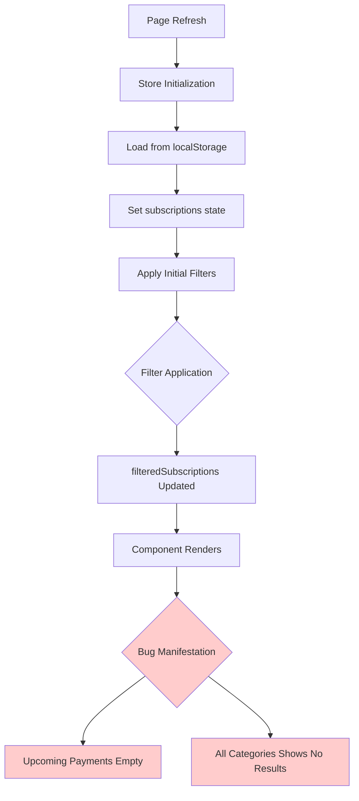
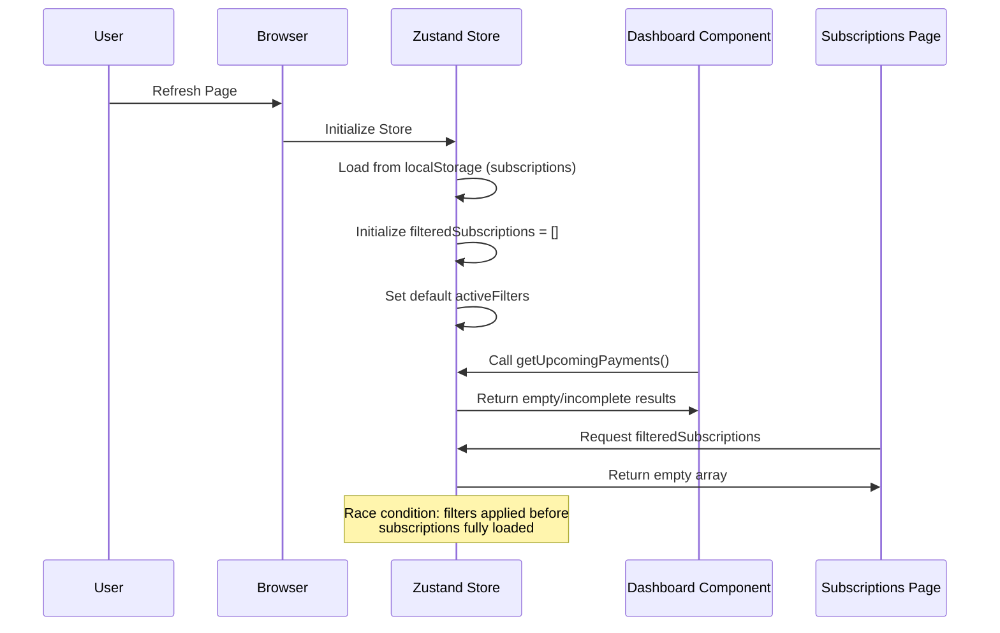
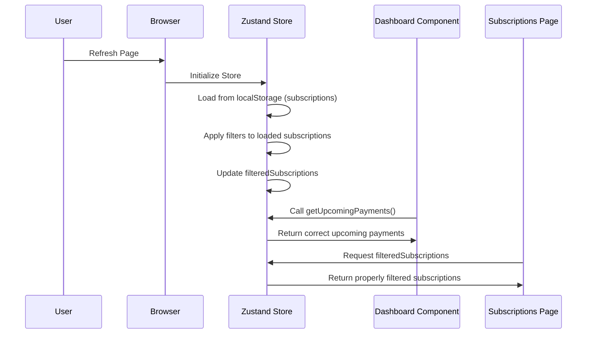

# Subscription Category Display Fix

## Overview

This design addresses a critical bug in the subscription tracker application where subscriptions with assigned categories are not being displayed in the upcoming payments section of the dashboard or in the "all categories" filter view on the subscriptions page after browser refresh. The issue stems from inconsistent state management and filter application during data persistence and restoration.

## Architecture

### Problem Analysis

The bug manifests in two specific scenarios:

1. **Dashboard Upcoming Payments**: Subscriptions with categories fail to appear in the upcoming payments widget
2. **Subscriptions Page "All Categories"**: After refresh, subscriptions are not visible when "All Categories" filter is selected

### Root Cause Identification



### Core Issues

1. **State Persistence Race Condition**: The `filteredSubscriptions` array is not properly synchronized with the restored `subscriptions` data on page load
2. **Filter Application Timing**: Initial filter application occurs before subscription data is fully restored from localStorage
3. **Dashboard Data Source**: Upcoming payments calculation relies on the raw `subscriptions` array but may be affected by initialization timing

## Data Flow Issues

### Current Problematic Flow



### Expected Correct Flow



## State Management Fixes

### Store Initialization Enhancement

The primary fix involves ensuring that `filteredSubscriptions` is properly initialized when subscriptions are restored from localStorage:

```javascript
// Current problematic initialization
subscriptions: [],
filteredSubscriptions: [], // This remains empty on restore

// Fixed initialization
subscriptions: [],
get filteredSubscriptions() {
  return this.applyFilters(this.subscriptions);
},
```

### Filter Application Consistency

Ensure filters are consistently applied across all state mutations:

1. **addSubscription**: Apply filters to new subscription array
2. **updateSubscription**: Reapply filters after update
3. **deleteSubscription**: Reapply filters after deletion
4. **Store restoration**: Apply filters during initialization

### Data Persistence Strategy

Modify the persistence configuration to exclude `filteredSubscriptions` from localStorage since it should be computed:

```javascript
partialize: (state) => ({
  subscriptions: state.subscriptions,
  activeFilters: state.activeFilters,
  // Remove filteredSubscriptions from persistence
}),
```

## Component Integration Fixes

### Dashboard Component Updates

Ensure the Dashboard component properly handles the upcoming payments calculation:

1. **Data Dependencies**: Explicitly depend on subscription changes
2. **Effect Optimization**: Use proper dependency arrays in useEffect
3. **Error Handling**: Add fallback for empty/loading states

### Subscriptions Page Enhancements

1. **Filter State Sync**: Ensure UI filter state matches store state
2. **Initial Load**: Properly trigger filter application on component mount
3. **Search Integration**: Ensure search works with filtered results

## State Synchronization Strategy

### Computed Properties Approach

Replace the stored `filteredSubscriptions` with a computed getter:

```javascript
const useSubscriptionStore = create(
  devtools(
    persist(
      (set, get) => ({
        // Core state
        subscriptions: [],
        activeFilters: {
          category: 'all',
          status: 'all',
          sortBy: 'name',
          sortOrder: 'asc',
        },

        // Computed property
        get filteredSubscriptions() {
          return get().applyFilters(get().subscriptions);
        },

        // Actions remain the same but don't manually update filteredSubscriptions
        addSubscription: (subscriptionData) => {
          // Implementation without manual filteredSubscriptions update
        },
      })
    )
  )
);
```

### Alternative Reactive Approach

If computed properties are not feasible, implement a reactive update system:

```javascript
// Helper function to ensure filteredSubscriptions stays in sync
const updateSubscriptionsAndFilters = (newSubscriptions) => {
  const filtered = get().applyFilters(newSubscriptions);
  return {
    subscriptions: newSubscriptions,
    filteredSubscriptions: filtered,
  };
};
```

## Implementation Strategy

### Phase 1: Store Fixes

1. **Remove filteredSubscriptions from persistence**
2. **Implement computed filteredSubscriptions getter**
3. **Update all action methods to use new pattern**
4. **Add initialization hook for proper filter application**

### Phase 2: Component Updates

1. **Update Dashboard to handle computed properties**
2. **Fix Subscriptions page filter synchronization**
3. **Add loading states and error handling**
4. **Implement proper effect dependencies**

### Phase 3: Testing Strategy

1. **State Persistence Tests**: Verify data survives page refresh
2. **Filter Application Tests**: Test all filter combinations
3. **Dashboard Integration Tests**: Verify upcoming payments accuracy
4. **Cross-Component Tests**: Ensure state consistency across pages

## Error Handling Enhancements

### Fallback Mechanisms

1. **Empty State Handling**: Graceful degradation when no subscriptions exist
2. **Loading States**: Proper loading indicators during state initialization
3. **Filter Reset**: Option to reset filters if results are unexpectedly empty

### Debug Tools

1. **State Logging**: Enhanced logging for store state changes
2. **Filter Debugging**: Debug information for filter application
3. **Persistence Monitoring**: Track localStorage read/write operations

## Testing Requirements

### Unit Tests

1. **Store Behavior**: Test all store actions and getters
2. **Filter Logic**: Comprehensive filter application testing
3. **State Persistence**: Test localStorage integration

### Integration Tests

1. **Page Refresh Scenarios**: Test complete refresh workflows
2. **Cross-Component State**: Verify state consistency across components
3. **Filter Interactions**: Test complex filter combinations

### User Acceptance Tests

1. **Dashboard Upcoming Payments**: Verify payments appear correctly after refresh
2. **All Categories Filter**: Confirm all subscriptions visible in "All Categories"
3. **Category-Specific Filters**: Test individual category filters work properly