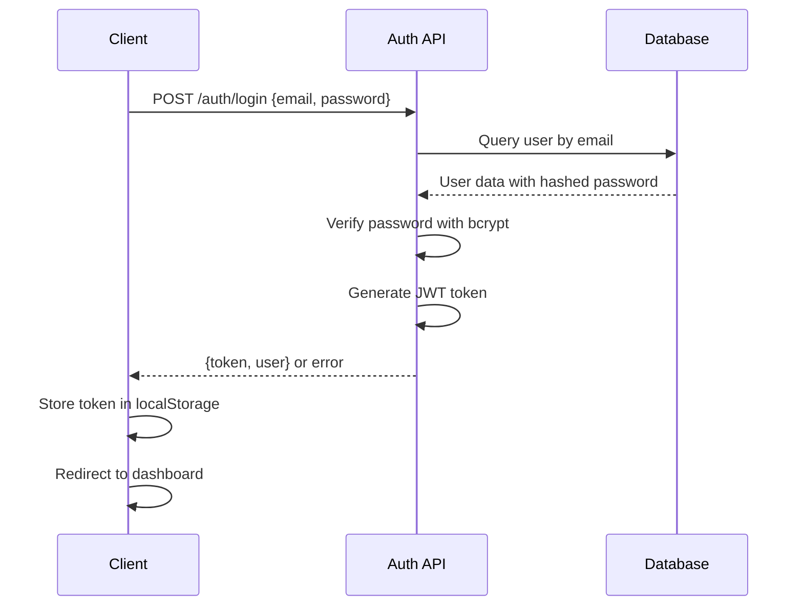
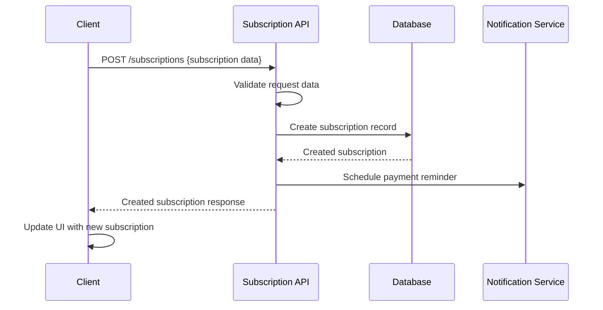
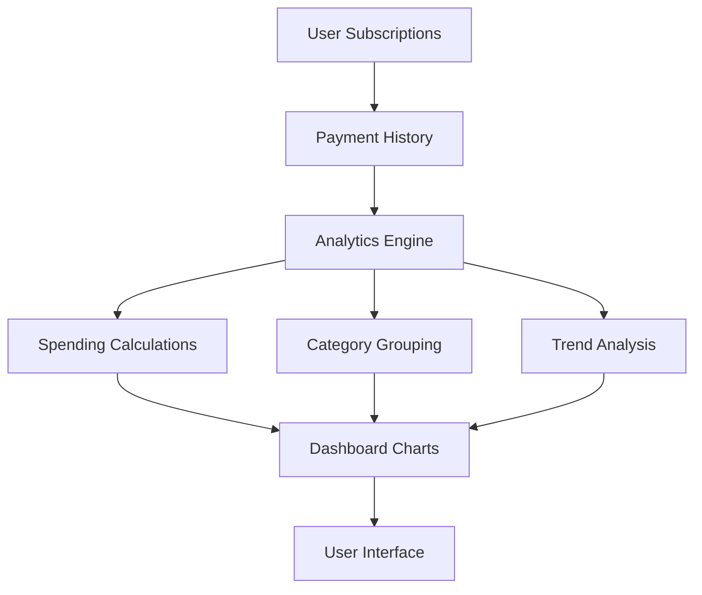

# Subscription Tracker Web Application Design

## Overview

The Subscription Tracker is a full-stack web application that helps users manage and monitor their recurring subscriptions and services. The application provides insights into spending patterns, upcoming payments, and subscription management features to help users control their recurring expenses.

### Key Features
- Track multiple subscription services
- Monitor upcoming payments and renewals
- Categorize subscriptions by type
- Calculate total monthly/yearly spending
- Set payment reminders and notifications
- Subscription analytics and spending insights
- Multi-currency support

### Target Users
- Individual consumers managing personal subscriptions
- Small business owners tracking business services
- Anyone looking to optimize their recurring expenses

## Technology Stack & Dependencies

### Frontend
- **Framework**: React 18 with TypeScript
- **State Management**: Zustand for lightweight state management
- **UI Library**: Tailwind CSS with Headless UI components
- **Charts**: Chart.js or Recharts for analytics visualization
- **Date Handling**: date-fns for date manipulation
- **HTTP Client**: Axios for API communication
- **Routing**: React Router v6
- **Form Handling**: React Hook Form with Zod validation

### Backend
- **Framework**: Node.js with Express.js
- **Language**: TypeScript
- **Database**: PostgreSQL with Prisma ORM
- **Authentication**: JWT with bcrypt for password hashing
- **Validation**: Zod for request/response validation
- **Environment**: dotenv for configuration
- **CORS**: cors middleware for cross-origin requests

## Frontend Architecture

### Component Architecture

#### Component Hierarchy
```
App
├── AuthProvider
├── Router
│   ├── PublicRoutes
│   │   ├── LoginPage
│   │   ├── RegisterPage
│   │   └── LandingPage
│   └── PrivateRoutes
│       ├── DashboardPage
│       ├── SubscriptionsPage
│       ├── AnalyticsPage
│       ├── SettingsPage
│       └── ProfilePage
├── Layout
│   ├── Header
│   ├── Sidebar
│   └── Footer
└── Shared Components
    ├── SubscriptionCard
    ├── PaymentCalendar
    ├── SpendingChart
    ├── Modal
    ├── Button
    ├── Input
    └── LoadingSpinner
```

#### Core Components

**SubscriptionCard Component**
```typescript
interface SubscriptionCardProps {
  subscription: Subscription;
  onEdit: (id: string) => void;
  onDelete: (id: string) => void;
  onToggleActive: (id: string) => void;
}
```

**PaymentCalendar Component**
```typescript
interface PaymentCalendarProps {
  subscriptions: Subscription[];
  selectedDate: Date;
  onDateSelect: (date: Date) => void;
}
```

**SpendingChart Component**
```typescript
interface SpendingChartProps {
  data: SpendingData[];
  timeRange: 'monthly' | 'yearly';
  chartType: 'line' | 'bar' | 'pie';
}
```

### State Management

#### Zustand Store Structure
```typescript
interface AppState {
  // User state
  user: User | null;
  isAuthenticated: boolean;
  
  // Subscriptions state
  subscriptions: Subscription[];
  filteredSubscriptions: Subscription[];
  selectedSubscription: Subscription | null;
  
  // UI state
  isLoading: boolean;
  activeFilters: FilterOptions;
  sortBy: SortOption;
  
  // Actions
  setUser: (user: User | null) => void;
  addSubscription: (subscription: CreateSubscriptionDto) => void;
  updateSubscription: (id: string, updates: Partial<Subscription>) => void;
  deleteSubscription: (id: string) => void;
  setFilters: (filters: FilterOptions) => void;
}
```

### Routing & Navigation

#### Route Structure
```typescript
const routes = [
  {
    path: '/',
    element: <LandingPage />,
    public: true
  },
  {
    path: '/login',
    element: <LoginPage />,
    public: true
  },
  {
    path: '/register',
    element: <RegisterPage />,
    public: true
  },
  {
    path: '/dashboard',
    element: <DashboardPage />,
    protected: true
  },
  {
    path: '/subscriptions',
    element: <SubscriptionsPage />,
    protected: true
  },
  {
    path: '/analytics',
    element: <AnalyticsPage />,
    protected: true
  },
  {
    path: '/settings',
    element: <SettingsPage />,
    protected: true
  }
];
```

### Styling Strategy

#### Tailwind CSS Configuration
- Custom color palette for subscription categories
- Responsive design breakpoints
- Dark/light theme support
- Component-specific utility classes

#### Theme System
```css
:root {
  --color-primary: #3b82f6;
  --color-secondary: #64748b;
  --color-success: #10b981;
  --color-warning: #f59e0b;
  --color-danger: #ef4444;
  --color-subscription-entertainment: #e11d48;
  --color-subscription-utilities: #059669;
  --color-subscription-software: #7c3aed;
}
```

### API Integration Layer

#### API Service Structure
```typescript
class ApiService {
  private baseURL: string;
  private authToken: string | null;
  
  // Auth methods
  login(credentials: LoginDto): Promise<AuthResponse>;
  register(userData: RegisterDto): Promise<AuthResponse>;
  logout(): Promise<void>;
  
  // Subscription methods
  getSubscriptions(): Promise<Subscription[]>;
  createSubscription(data: CreateSubscriptionDto): Promise<Subscription>;
  updateSubscription(id: string, data: UpdateSubscriptionDto): Promise<Subscription>;
  deleteSubscription(id: string): Promise<void>;
  
  // Analytics methods
  getSpendingAnalytics(timeRange: string): Promise<SpendingAnalytics>;
  getUpcomingPayments(): Promise<Payment[]>;
}
```

## Backend Architecture

### API Endpoints Reference

#### Authentication Endpoints
```
POST /api/auth/register
POST /api/auth/login
POST /api/auth/logout
POST /api/auth/refresh
GET  /api/auth/me
```

#### Subscription Management Endpoints
```
GET    /api/subscriptions           # Get user's subscriptions
POST   /api/subscriptions           # Create new subscription
GET    /api/subscriptions/:id       # Get specific subscription
PUT    /api/subscriptions/:id       # Update subscription
DELETE /api/subscriptions/:id       # Delete subscription
PATCH  /api/subscriptions/:id/toggle # Toggle active status
```

#### Analytics Endpoints
```
GET /api/analytics/spending          # Get spending analytics
GET /api/analytics/upcoming-payments # Get upcoming payments
GET /api/analytics/categories        # Get spending by category
GET /api/analytics/trends           # Get spending trends
```

#### Request/Response Schemas

**Create Subscription Request**
```typescript
interface CreateSubscriptionDto {
  name: string;
  description?: string;
  amount: number;
  currency: string;
  billingCycle: 'monthly' | 'yearly' | 'weekly';
  nextPaymentDate: Date;
  category: string;
  website?: string;
  isActive: boolean;
}
```

**Subscription Response**
```typescript
interface Subscription {
  id: string;
  name: string;
  description?: string;
  amount: number;
  currency: string;
  billingCycle: 'monthly' | 'yearly' | 'weekly';
  nextPaymentDate: Date;
  category: string;
  website?: string;
  isActive: boolean;
  createdAt: Date;
  updatedAt: Date;
  userId: string;
}
```

### Data Models & ORM Mapping

#### Prisma Schema
```prisma
model User {
  id            String    @id @default(cuid())
  email         String    @unique
  name          String?
  passwordHash  String
  currency      String    @default("USD")
  timezone      String    @default("UTC")
  createdAt     DateTime  @default(now())
  updatedAt     DateTime  @updatedAt
  subscriptions Subscription[]
}

model Subscription {
  id              String   @id @default(cuid())
  name            String
  description     String?
  amount          Decimal  @db.Decimal(10, 2)
  currency        String
  billingCycle    BillingCycle
  nextPaymentDate DateTime
  category        String
  website         String?
  isActive        Boolean  @default(true)
  createdAt       DateTime @default(now())
  updatedAt       DateTime @updatedAt
  user            User     @relation(fields: [userId], references: [id], onDelete: Cascade)
  userId          String
  payments        Payment[]
}

model Payment {
  id             String       @id @default(cuid())
  amount         Decimal      @db.Decimal(10, 2)
  currency       String
  paymentDate    DateTime
  status         PaymentStatus @default(PENDING)
  subscription   Subscription @relation(fields: [subscriptionId], references: [id], onDelete: Cascade)
  subscriptionId String
  createdAt      DateTime     @default(now())
}

enum BillingCycle {
  WEEKLY
  MONTHLY
  YEARLY
}

enum PaymentStatus {
  PENDING
  COMPLETED
  FAILED
  CANCELLED
}
```

### Business Logic Layer

#### Subscription Service Architecture
```typescript
class SubscriptionService {
  async createSubscription(userId: string, data: CreateSubscriptionDto): Promise<Subscription> {
    // Validate subscription data
    // Calculate next payment date based on billing cycle
    // Save to database
    // Schedule payment reminder
  }
  
  async updateSubscription(id: string, userId: string, data: UpdateSubscriptionDto): Promise<Subscription> {
    // Verify ownership
    // Update subscription
    // Recalculate payment schedule if needed
  }
  
  async calculateUpcomingPayments(userId: string, days: number = 30): Promise<Payment[]> {
    // Get active subscriptions
    // Calculate payments due within specified days
    // Return sorted by date
  }
  
  async getSpendingAnalytics(userId: string, timeRange: string): Promise<SpendingAnalytics> {
    // Aggregate spending data
    // Group by categories and time periods
    // Calculate trends and insights
  }
}
```

#### Analytics Service Architecture
```typescript
class AnalyticsService {
  async generateSpendingReport(userId: string, period: 'month' | 'year'): Promise<SpendingReport> {
    // Query payment history
    // Calculate totals by category
    // Generate spending trends
    // Compare with previous periods
  }
  
  async predictNextMonthSpending(userId: string): Promise<PredictionResult> {
    // Analyze historical data
    // Account for billing cycles
    // Calculate projected spending
  }
}
```

### Middleware & Interceptors

#### Authentication Middleware
```typescript
const authenticateToken = (req: Request, res: Response, next: NextFunction) => {
  const authHeader = req.headers['authorization'];
  const token = authHeader && authHeader.split(' ')[1];
  
  if (!token) {
    return res.status(401).json({ error: 'Access token required' });
  }
  
  jwt.verify(token, process.env.JWT_SECRET!, (err, user) => {
    if (err) return res.status(403).json({ error: 'Invalid token' });
    req.user = user;
    next();
  });
};
```

#### Validation Middleware
```typescript
const validateRequest = (schema: z.ZodSchema) => {
  return (req: Request, res: Response, next: NextFunction) => {
    try {
      schema.parse(req.body);
      next();
    } catch (error) {
      res.status(400).json({ error: 'Validation failed', details: error.errors });
    }
  };
};
```

## Data Flow Between Layers

### User Authentication Flow


### Subscription Management Flow


### Analytics Data Flow


