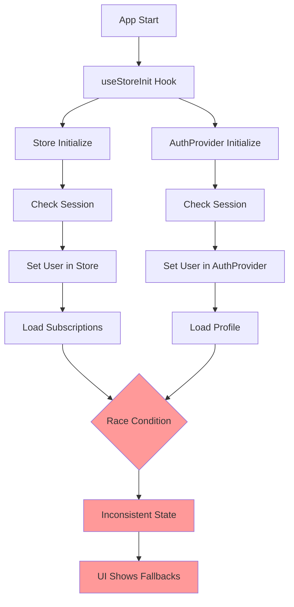
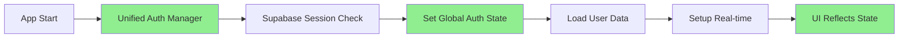
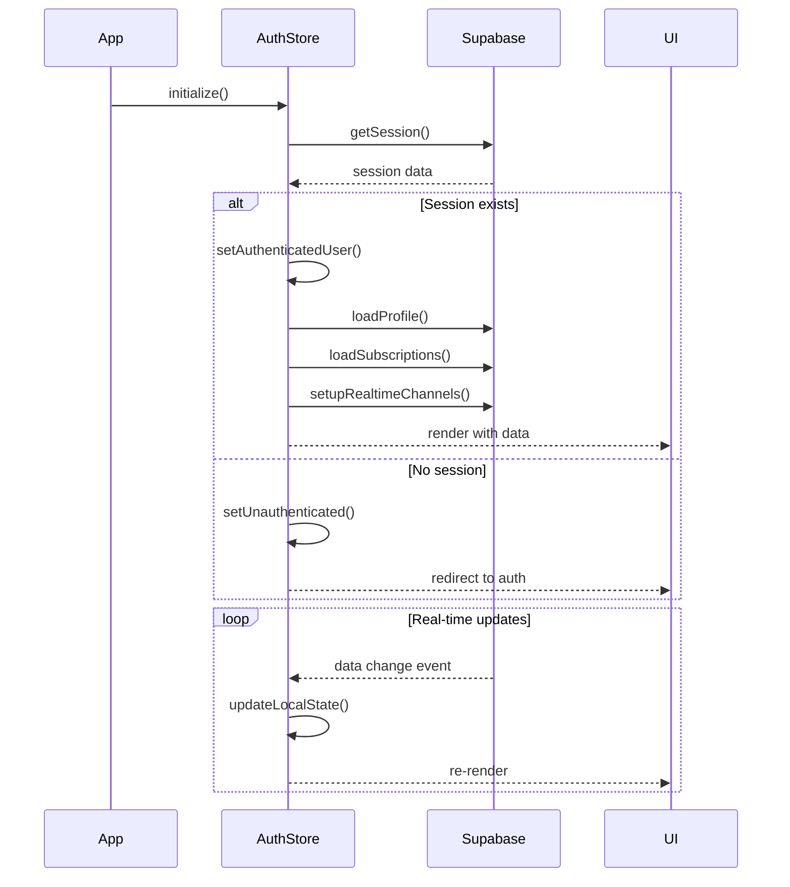
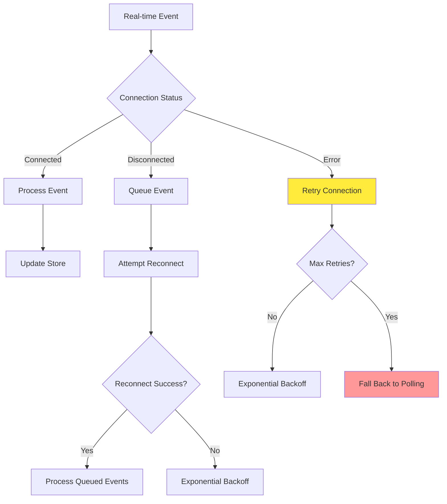
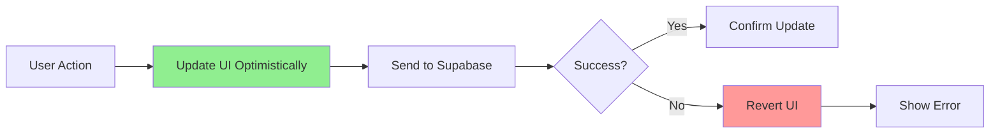
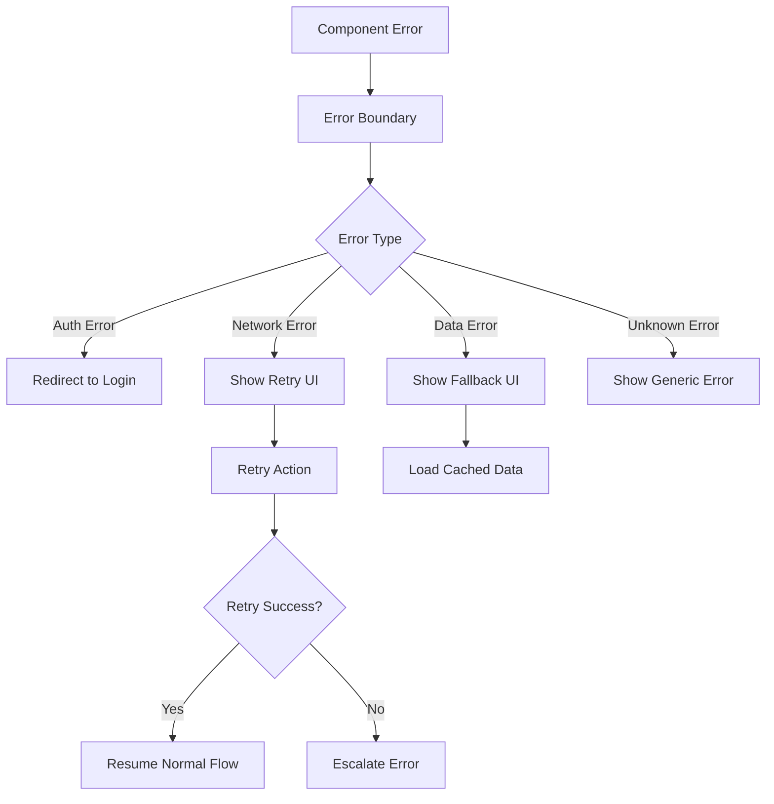

# Supabase Connection Debug & Fix

## Overview

This design addresses critical Supabase connection issues causing:
1. Subscriptions loading initially but not displaying on subsequent renders
2. User name displaying fallback values instead of actual profile data
3. Real-time synchronization failures
4. Inconsistent authentication state management

The issues stem from race conditions between multiple authentication systems, improper error handling, and conflicting state management patterns.

## Architecture

### Current Problem Analysis



### Root Cause Issues

#### 1. Dual Authentication Systems
- **Store-based auth**: `useStoreInit` + Zustand store
- **Context-based auth**: `AuthProvider` + React Context
- **Problem**: Both systems independently manage user state, causing conflicts

#### 2. Persistence Layer Conflicts
- **Store persistence**: Uses localStorage with Zustand persist middleware
- **Supabase auth**: Uses localStorage for session persistence
- **Problem**: Persisted store state doesn't match fresh Supabase session state

#### 3. Real-time Subscription Issues
- **Channel naming**: Generic 'subscriptions-changes' channel name
- **Cleanup**: Incomplete cleanup of real-time subscriptions
- **Error handling**: No fallback when real-time fails

#### 4. Profile Loading Race Conditions
- **Header component**: Tries to display user name before profile loads
- **Fallback logic**: Inconsistent between store and auth provider
- **Timing**: Profile loading happens after UI render

## Unified Authentication System

### Single Source of Truth Pattern



#### Centralized Authentication Store

```javascript
// Enhanced store structure
{
  // Auth state
  auth: {
    user: null,
    profile: null, 
    session: null,
    isAuthenticated: false,
    isLoading: true,
    error: null
  },
  
  // Data state  
  data: {
    subscriptions: [],
    filteredSubscriptions: [],
    isLoading: false,
    error: null
  },
  
  // Real-time state
  realtime: {
    subscriptionsChannel: null,
    profileChannel: null,
    connectionStatus: 'disconnected'
  }
}
```

#### Authentication Lifecycle



## Real-time Connection Improvements

### Enhanced Channel Management

#### User-Specific Channels
```javascript
// Current problematic approach
channel('subscriptions-changes')

// Fixed approach with user isolation
channel(`user:${userId}:subscriptions`)
channel(`user:${userId}:profile`)
```

#### Connection Health Monitoring
```javascript
// Real-time connection status tracking
const realtimeStatus = {
  subscriptions: 'connected' | 'disconnected' | 'error',
  profile: 'connected' | 'disconnected' | 'error',
  lastHeartbeat: timestamp,
  reconnectAttempts: number
}
```

#### Robust Error Handling


## Data Loading Strategy

### Progressive Loading Pattern

#### Initial Load Sequence
1. **Immediate**: Show cached/persisted data if available
2. **Background**: Fetch fresh data from Supabase
3. **Update**: Replace cache with fresh data
4. **Real-time**: Enable live updates

#### Error Recovery Mechanisms
```javascript
// Multi-tier fallback strategy
const loadingStrategy = {
  primary: 'supabase_realtime',
  fallback1: 'supabase_polling', 
  fallback2: 'cached_data',
  fallback3: 'offline_mode'
}
```

### Optimistic Updates



## Profile Data Management

### Consistent Display Name Logic

#### Unified Display Name Function
```javascript
const getDisplayName = (user, profile) => {
  // Priority order for display name
  if (profile?.full_name?.trim()) {
    return profile.full_name.trim();
  }
  
  if (profile?.display_name?.trim()) {
    return profile.display_name.trim();
  }
  
  if (user?.user_metadata?.full_name?.trim()) {
    return user.user_metadata.full_name.trim();
  }
  
  if (user?.email) {
    return user.email.split('@')[0];
  }
  
  return 'User';
};
```

#### Profile Loading States
```javascript
const profileStates = {
  'not_loaded': 'User',           // Show fallback
  'loading': 'Loading...',        // Show loading state  
  'loaded': profile.full_name,    // Show actual name
  'error': 'User'                 // Show fallback on error
}
```

## Store Architecture Refactoring

### Separated Concerns

#### Authentication Module
```javascript
const authSlice = {
  state: { user, profile, session, isAuthenticated, loading, error },
  actions: { 
    initialize, 
    signIn, 
    signOut, 
    loadProfile, 
    updateProfile 
  }
}
```

#### Data Module
```javascript
const dataSlice = {
  state: { subscriptions, filteredSubscriptions, loading, error },
  actions: { 
    loadSubscriptions, 
    addSubscription, 
    updateSubscription, 
    deleteSubscription 
  }
}
```

#### Real-time Module
```javascript
const realtimeSlice = {
  state: { channels, connectionStatus, lastSync },
  actions: { 
    setupChannels, 
    cleanupChannels, 
    handleReconnect 
  }
}
```

### Improved Error Boundaries



## Testing Strategy

### Connection Reliability Tests

#### Authentication Flow Testing
```javascript
describe('Authentication Flow', () => {
  test('handles session restoration on app start')
  test('handles network interruption during auth')
  test('handles concurrent auth state changes')
  test('handles expired session refresh')
})
```

#### Real-time Connection Testing  
```javascript
describe('Real-time Connection', () => {
  test('establishes connection on auth')
  test('handles connection drops gracefully')
  test('queues updates during disconnection')
  test('syncs queued updates on reconnection')
})
```

#### Data Loading Testing
```javascript
describe('Data Loading', () => {
  test('shows cached data immediately')
  test('fetches fresh data in background') 
  test('handles loading state transitions')
  test('falls back to cache on network failure')
})
```

### Error Scenario Testing

#### Network Conditions
- **Offline Mode**: App functions with cached data
- **Intermittent Connection**: Graceful degradation
- **Slow Network**: Progressive loading with timeouts
- **Connection Loss**: Automatic reconnection

#### Race Condition Testing
- **Rapid Auth Changes**: Multiple sign-in/out cycles
- **Concurrent Data Updates**: Multiple tabs/devices
- **Session Refresh**: Token renewal during operations

## Migration Strategy

### Phase 1: Consolidate Authentication
1. Remove duplicate auth providers
2. Centralize auth state in enhanced store
3. Update all components to use single auth source
4. Test auth flow stability

### Phase 2: Fix Real-time Connections
1. Implement user-specific channels
2. Add connection health monitoring  
3. Implement robust error handling
4. Test real-time reliability

### Phase 3: Optimize Data Loading
1. Implement progressive loading
2. Add optimistic updates
3. Improve error recovery
4. Test data consistency

### Phase 4: Enhanced Error Handling
1. Add comprehensive error boundaries
2. Implement fallback mechanisms
3. Add user-friendly error messages
4. Test error scenarios

## Performance Optimizations

### Reduced Network Calls
- **Batch Operations**: Group related API calls
- **Smart Caching**: Cache with TTL and invalidation
- **Selective Sync**: Only sync changed data
- **Lazy Loading**: Load data as needed

### Memory Management
- **Cleanup Subscriptions**: Proper real-time cleanup
- **Limit Store Size**: Remove old cached data
- **Optimize Re-renders**: Selective state updates
- **Memory Leak Prevention**: Cleanup on unmount

### Connection Efficiency
- **Connection Pooling**: Reuse Supabase connections
- **Heartbeat Optimization**: Efficient keep-alive
- **Bandwidth Management**: Compress large payloads
- **Priority Queuing**: Critical updates first