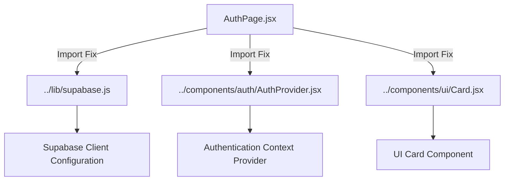
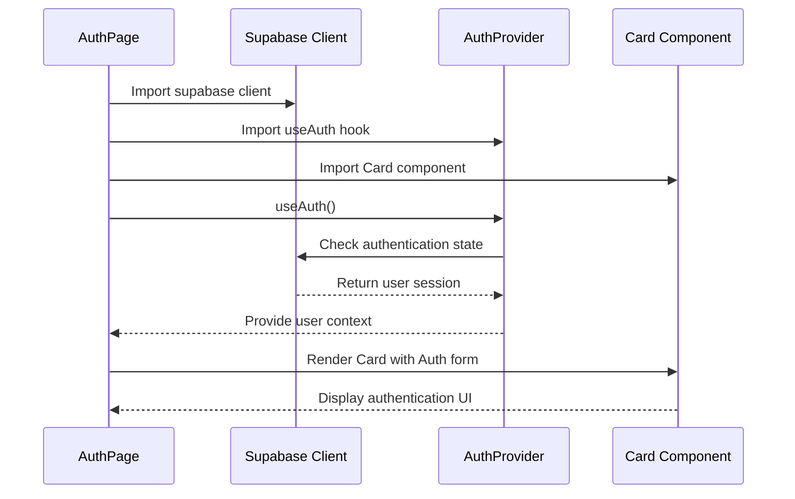

# Supabase Import Fix Design

## Overview

The application is encountering import resolution errors in `AuthPage.jsx` due to incorrect relative import paths. The error occurs when Vite attempts to resolve the import for the Supabase client configuration. This design addresses the import path corrections needed to resolve the build failures.

## Repository Type Detection

This is a **Frontend Application** built with:
- React 18 with Vite build tool
- Supabase for authentication and backend services
- Tailwind CSS for styling
- React Router for navigation

## Architecture

### Current File Structure
```
src/
├── pages/
│   └── AuthPage.jsx          # ❌ Incorrect import paths
├── components/
│   └── auth/
│       └── AuthProvider.jsx  # ✅ Actual location
├── lib/
│   └── supabase.js          # ✅ Supabase client config
└── ui/
    └── Card.jsx             # ✅ UI component
```

### Import Path Analysis

| Component | Current Import | Correct Import | Status |
|-----------|---------------|----------------|--------|
| `supabase.js` | `../../lib/supabase.js` | `../lib/supabase.js` | ❌ Incorrect |
| `AuthProvider.jsx` | `./AuthProvider.jsx` | `../components/auth/AuthProvider.jsx` | ❌ Incorrect |
| `Card.jsx` | `../ui/Card.jsx` | `../components/ui/Card.jsx` | ❌ Incorrect |

## Component Architecture

### AuthPage Component Fix

The `AuthPage.jsx` component requires three critical import corrections:



### Import Resolution Strategy

#### Current Problem
- `AuthPage.jsx` is located at `src/pages/AuthPage.jsx`
- Import paths assume different directory structure
- Vite fails to resolve modules during build process

#### Solution Mapping

1. **Supabase Client Import**
   - From: `../../lib/supabase.js` (goes up 2 levels)
   - To: `../lib/supabase.js` (goes up 1 level)
   - Reason: `pages/` is only 1 level deep from `src/`

2. **AuthProvider Import**
   - From: `./AuthProvider.jsx` (same directory)
   - To: `../components/auth/AuthProvider.jsx`
   - Reason: `AuthProvider.jsx` is in `components/auth/` not `pages/`

3. **Card Component Import**
   - From: `../ui/Card.jsx`
   - To: `../components/ui/Card.jsx`
   - Reason: UI components are in `components/ui/` directory

## Data Flow

### Authentication Flow After Fix



## Implementation Details

### File Modifications Required

#### AuthPage.jsx Import Block
```javascript
// Current (Broken)
import { supabase } from '../../lib/supabase.js';
import { useAuth } from './AuthProvider.jsx';
import { Card } from '../ui/Card.jsx';

// Fixed
import { supabase } from '../lib/supabase.js';
import { useAuth } from '../components/auth/AuthProvider.jsx';
import { Card } from '../components/ui/Card.jsx';
```

### Module Resolution Verification

After implementing the fixes, the following should be verified:

1. **Vite Build Process**
   - No import resolution errors
   - Successful module bundling
   - Proper dependency tree construction

2. **Runtime Functionality**
   - Supabase client initializes correctly
   - Authentication provider context available
   - UI components render properly

3. **Development Server**
   - Hot module replacement works
   - No console errors related to imports
   - Proper source mapping

## Testing Strategy

### Import Resolution Testing
1. **Build Test**: Run `npm run build` to verify Vite can resolve all imports
2. **Development Test**: Start dev server with `npm run dev`
3. **Component Test**: Navigate to auth page and verify no console errors
4. **Functional Test**: Test authentication flow end-to-end

### Validation Checklist
- [ ] Vite development server starts without errors
- [ ] Production build completes successfully  
- [ ] AuthPage component renders correctly
- [ ] Supabase authentication functions work
- [ ] Navigation and routing function properly
- [ ] No console warnings about missing modulesimport { Card } from '../components/ui/Card.jsx';
```

### Module Resolution Verification

After implementing the fixes, the following should be verified:

1. **Vite Build Process**
   - No import resolution errors
   - Successful module bundling
   - Proper dependency tree construction

2. **Runtime Functionality**
   - Supabase client initializes correctly
   - Authentication provider context available
   - UI components render properly

3. **Development Server**
   - Hot module replacement works
   - No console errors related to imports
   - Proper source mapping

## Testing Strategy

### Import Resolution Testing
1. **Build Test**: Run `npm run build` to verify Vite can resolve all imports
2. **Development Test**: Start dev server with `npm run dev`
3. **Component Test**: Navigate to auth page and verify no console errors
4. **Functional Test**: Test authentication flow end-to-end

### Validation Checklist
- [ ] Vite development server starts without errors
- [ ] Production build completes successfully  
- [ ] AuthPage component renders correctly
- [ ] Supabase authentication functions work
- [ ] Navigation and routing function properly
- [ ] No console warnings about missing modules


