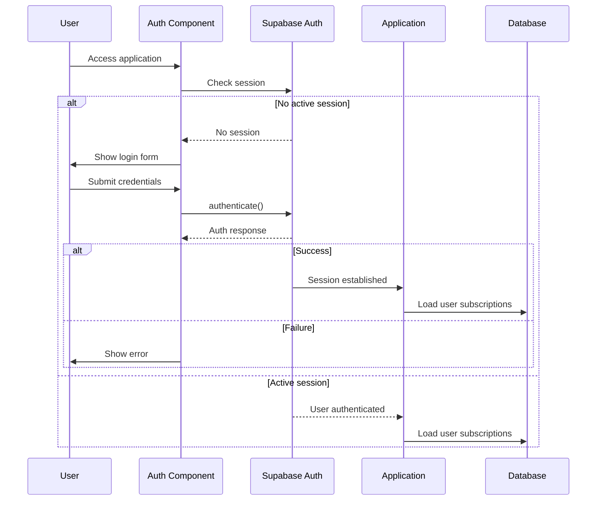
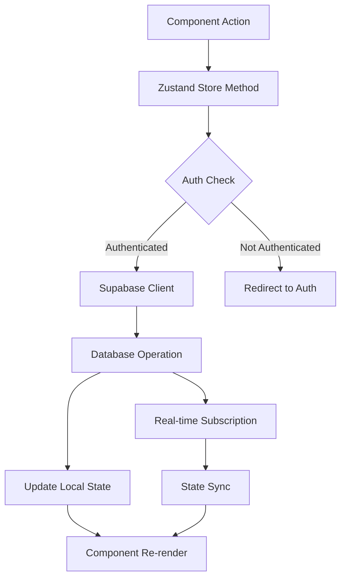
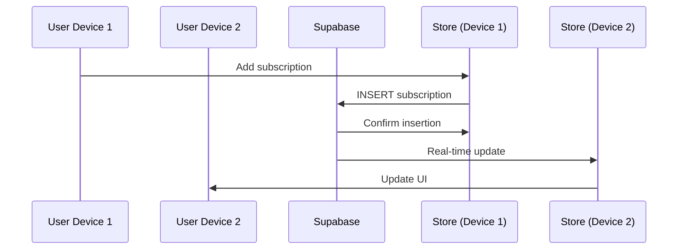
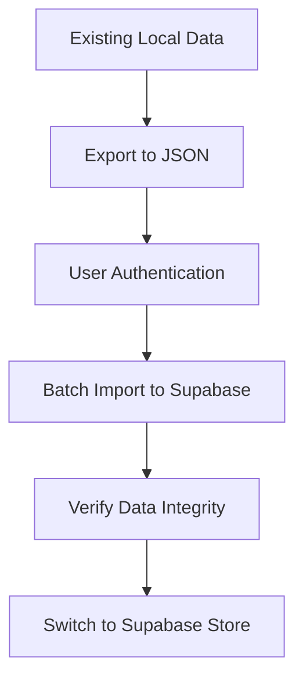
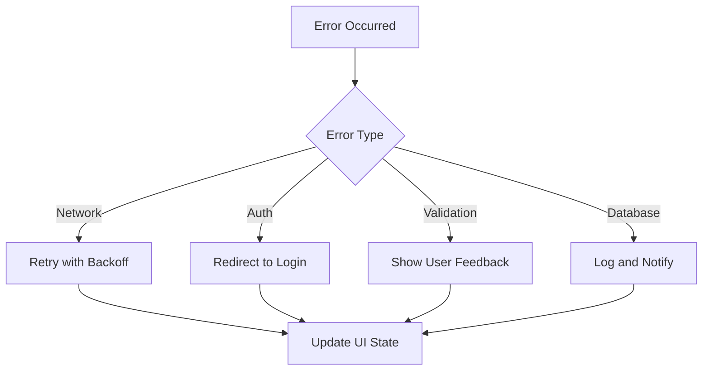

# Supabase Integration for User Subscription Management

## Overview

This design outlines the integration of Supabase as the backend-as-a-service platform for the subscription tracker application. The integration will enable user authentication, per-user data isolation, and cloud-based subscription storage, transforming the current client-side application into a multi-user SaaS platform.

The integration will maintain the existing React frontend architecture while replacing the local Zustand store with Supabase's PostgreSQL database and adding user authentication capabilities. This approach ensures data persistence across devices, enables sharing capabilities, and provides a foundation for future collaboration features.

## Technology Stack & Dependencies

### New Dependencies
- **@supabase/supabase-js**: Official Supabase JavaScript client library
- **@supabase/auth-ui-react**: Pre-built authentication UI components
- **@supabase/auth-ui-shared**: Shared utilities for auth UI components

### Integration with Existing Stack
- **React 18**: Frontend framework (unchanged)
- **Zustand**: State management (modified for Supabase integration)
- **Tailwind CSS**: Styling (unchanged)
- **React Router**: Navigation (enhanced with auth guards)
- **Vite**: Build tool (unchanged)

## Authentication Architecture

### User Authentication Flow



### Authentication Components

#### AuthProvider Component
- Wraps the entire application to provide authentication context
- Manages session state and user information
- Handles authentication state changes
- Provides authentication methods to child components

#### ProtectedRoute Component
- Guards protected routes requiring authentication
- Redirects unauthenticated users to login page
- Manages loading states during authentication checks

#### AuthPage Component
- Renders authentication forms (login/signup)
- Utilizes Supabase Auth UI components
- Handles OAuth providers (Google, GitHub, etc.)
- Manages authentication error states

## Database Schema Design

### Users Table (Managed by Supabase Auth)
```sql
-- Supabase automatically manages the auth.users table
-- Additional user profile data can be stored in a custom profiles table
```

### Profiles Table
```sql
CREATE TABLE profiles (
  id UUID REFERENCES auth.users(id) PRIMARY KEY,
  email TEXT,
  full_name TEXT,
  avatar_url TEXT,
  created_at TIMESTAMP WITH TIME ZONE DEFAULT NOW(),
  updated_at TIMESTAMP WITH TIME ZONE DEFAULT NOW()
);
```

### Subscriptions Table
```sql
CREATE TABLE subscriptions (
  id UUID DEFAULT gen_random_uuid() PRIMARY KEY,
  user_id UUID REFERENCES auth.users(id) ON DELETE CASCADE,
  name TEXT NOT NULL,
  description TEXT,
  amount DECIMAL(10,2) NOT NULL,
  currency TEXT DEFAULT 'USD',
  billing_cycle TEXT NOT NULL CHECK (billing_cycle IN ('weekly', 'monthly', 'yearly')),
  next_payment_date DATE NOT NULL,
  category TEXT NOT NULL CHECK (category IN ('entertainment', 'utilities', 'software', 'food', 'health', 'other')),
  website TEXT,
  is_active BOOLEAN DEFAULT true,
  created_at TIMESTAMP WITH TIME ZONE DEFAULT NOW(),
  updated_at TIMESTAMP WITH TIME ZONE DEFAULT NOW()
);
```

### Row Level Security (RLS) Policies
```sql
-- Enable RLS on subscriptions table
ALTER TABLE subscriptions ENABLE ROW LEVEL SECURITY;

-- Policy: Users can only see their own subscriptions
CREATE POLICY "Users can view own subscriptions" ON subscriptions
  FOR SELECT USING (auth.uid() = user_id);

-- Policy: Users can only insert their own subscriptions
CREATE POLICY "Users can insert own subscriptions" ON subscriptions
  FOR INSERT WITH CHECK (auth.uid() = user_id);

-- Policy: Users can only update their own subscriptions
CREATE POLICY "Users can update own subscriptions" ON subscriptions
  FOR UPDATE USING (auth.uid() = user_id);

-- Policy: Users can only delete their own subscriptions
CREATE POLICY "Users can delete own subscriptions" ON subscriptions
  FOR DELETE USING (auth.uid() = user_id);
```

## State Management Architecture

### Enhanced Zustand Store with Supabase Integration



### Store Structure Modifications

#### Authentication State
```javascript
// New authentication-related state
authState: {
  user: null,
  session: null,
  loading: true,
  error: null
}
```

#### Enhanced Subscription Management
- Replace local storage persistence with Supabase database operations
- Add user context to all subscription operations
- Implement optimistic updates for better UX
- Add real-time subscriptions for data synchronization

### Real-time Data Synchronization



## API Integration Layer

### Supabase Client Configuration
```javascript
// supabase/client.js
import { createClient } from '@supabase/supabase-js'

const supabaseUrl = import.meta.env.VITE_SUPABASE_URL
const supabaseAnonKey = import.meta.env.VITE_SUPABASE_ANON_KEY

export const supabase = createClient(supabaseUrl, supabaseAnonKey)
```

### Subscription Service Layer
```javascript
// services/subscriptionService.js
class SubscriptionService {
  async getSubscriptions() {
    // Fetch user's subscriptions with RLS automatically applied
  }
  
  async createSubscription(data) {
    // Create new subscription with user_id automatically set
  }
  
  async updateSubscription(id, updates) {
    // Update subscription with RLS validation
  }
  
  async deleteSubscription(id) {
    // Delete subscription with RLS validation
  }
  
  subscribeToChanges(callback) {
    // Set up real-time subscription to subscription changes
  }
}
```

## Component Architecture Updates

### App Component Modifications
```javascript
// App.jsx structure
function App() {
  return (
    <AuthProvider>
      <Router>
        <Routes>
          <Route path="/auth" element={<AuthPage />} />
          <Route path="/*" element={
            <ProtectedRoute>
              <Layout>
                {/* Existing routes */}
              </Layout>
            </ProtectedRoute>
          } />
        </Routes>
      </Router>
    </AuthProvider>
  )
}
```

### Enhanced Store Integration
- Modify existing components to handle authentication states
- Add loading states for database operations
- Implement error handling for network failures
- Add offline support with local caching

## Migration Strategy

### Phase 1: Infrastructure Setup
1. Create Supabase project and configure database
2. Set up authentication providers
3. Install required dependencies
4. Configure environment variables

### Phase 2: Authentication Implementation
1. Create authentication components
2. Implement route protection
3. Add user session management
4. Test authentication flows

### Phase 3: Database Migration
1. Create database schema
2. Implement RLS policies
3. Create subscription service layer
4. Migrate store to use Supabase operations

### Phase 4: Real-time Features
1. Implement real-time subscriptions
2. Add optimistic updates
3. Handle offline scenarios
4. Test multi-device synchronization

### Data Migration Approach


## Security Considerations

### Data Protection
- Row Level Security ensures user data isolation
- Environment variables protect sensitive credentials
- HTTPS enforced for all communications
- SQL injection prevention through parameterized queries

### Authentication Security
- OAuth integration for secure third-party authentication
- Session management through Supabase Auth
- Automatic token refresh handling
- Secure password policies enforcement

### Privacy Compliance
- User data deletion capabilities
- Data export functionality
- Clear privacy policy requirements
- GDPR compliance considerations

## Performance Optimization

### Database Performance
```sql
-- Indexes for optimal query performance
CREATE INDEX subscriptions_user_id_idx ON subscriptions (user_id);
CREATE INDEX subscriptions_next_payment_date_idx ON subscriptions (next_payment_date);
CREATE INDEX subscriptions_category_idx ON subscriptions (category);
CREATE INDEX subscriptions_is_active_idx ON subscriptions (is_active);
```

### Client-Side Optimization
- Implement pagination for large subscription lists
- Use optimistic updates for immediate UI feedback
- Cache frequently accessed data locally
- Implement intelligent data prefetching

### Real-time Connection Management
- Graceful handling of connection failures
- Automatic reconnection strategies
- Efficient subscription management
- Bandwidth optimization for mobile devices

## Testing Strategy

### Authentication Testing
- Unit tests for authentication utilities
- Integration tests for auth flows
- E2E tests for complete user journeys
- Security testing for unauthorized access

### Database Testing
- Unit tests for service layer methods
- Integration tests with Supabase client
- RLS policy verification tests
- Performance testing for database operations

### Component Testing
- Tests for auth-aware components
- Loading state verification
- Error handling validation
- Real-time update testing

## Error Handling & Monitoring

### Error Categories
1. **Authentication Errors**: Invalid credentials, session expiry
2. **Network Errors**: Connection failures, timeout issues
3. **Database Errors**: Constraint violations, RLS policy failures
4. **Validation Errors**: Invalid subscription data, missing fields

### Error Recovery Strategies


### Monitoring Integration
- Error tracking with Supabase monitoring
- Performance metrics collection
- User experience analytics
- Database query performance monitoring

## Environment Configuration

### Required Environment Variables
```env
VITE_SUPABASE_URL=your-supabase-project-url
VITE_SUPABASE_ANON_KEY=your-supabase-anon-key
VITE_SUPABASE_SERVICE_ROLE_KEY=your-service-role-key (for admin operations)
```

### Development vs Production Setup
- Separate Supabase projects for different environments
- Different authentication providers per environment
- Environment-specific database configurations
- Staging environment for testing migrations

This design provides a comprehensive roadmap for transforming the subscription tracker from a local application to a cloud-based, multi-user platform while maintaining the existing user experience and adding powerful new capabilities.