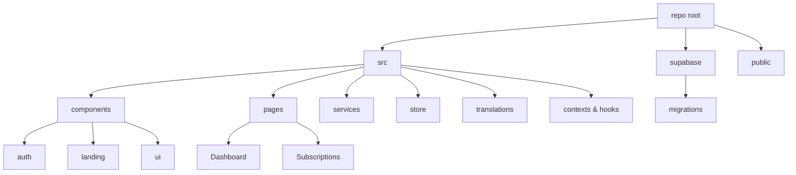

# subscription-tracker

subscription-tracker помогает небольшим командам и финансовым консультантам отслеживать платные сервисы, контролировать расходы и делиться аналитикой с клиентами без сложной настройки инфраструктуры.

## Оглавление
- [Возможности](#возможности)
- [Технологический стек](#технологический-стек)
- [Начало работы](#начало-работы)
- [Переменные окружения](#переменные-окружения)
- [Структура проекта](#структура-проекта)
- [Лицензия](#лицензия)

## Возможности
- Дашборд с аналитикой подписок и визуализацией расходов на основе компонентов Dashboard и Recharts.
- Управление подписками через модальные формы и карточки из каталога компонентов.
- Централизованная аутентификация, защищённые маршруты и интеграция с Supabase.
- Глобальное состояние на Zustand с инициализацией через единый store.
- Локализация интерфейса и переключатель языка с поддержкой нескольких переводов.
- Унифицированные сервисы работы с Supabase и датами для повторного использования логики.
- Миграции базы данных Supabase для развёртывания схемы и политик доступа.

## Технологический стек
- Фреймворк: React 19, React Router DOM 6
- Сборка и дев-сервер: Vite 7, @vitejs/plugin-react
- UI и стили: Tailwind CSS 3, class-variance-authority, clsx, lucide-react, tw-animate-css
- Состояние и данные: Zustand 5, date-fns 4, Recharts 2
- Бэкенд и аутентификация: @supabase/supabase-js 2, @vercel/analytics
- Линтинг и формат: ESLint 9, eslint-plugin-react-hooks, eslint-plugin-react-refresh, PostCSS, Autoprefixer

## Начало работы

### Требования
- Node.js LTS
- npm

### Установка
```bash
npm install
```

### Сценарии
- `npm run dev` — запуск среды разработки Vite.
- `npm run build` — сборка production-бандла.
- `npm run lint` — статический анализ кода ESLint.

### Запуск dev
```bash
npm run dev
```

## Переменные окружения
- `VITE_SUPABASE_URL` — URL проекта Supabase для доступа к базе и API.
- `VITE_SUPABASE_ANON_KEY` — публичный ключ анонимного доступа Supabase для клиентских запросов.

## Структура проекта
- `src/` — исходный код приложения на React.
- `src/components/` — UI-библиотека, авторизация, лендинг и общие элементы интерфейса.
- `src/pages/` — страницы авторизации, дашборда, подписок и настроек.
- `src/services/` — функции работы с Supabase и бизнес-логикой подписок.
- `src/store/` — централизованное Zustand-хранилище.
- `src/translations/` — словари и утилиты i18n.
- `supabase/` — миграции и документация по базе данных.
- `public/` — статические файлы и HTML-шаблон Vite.



## Лицензия
Уточняется
